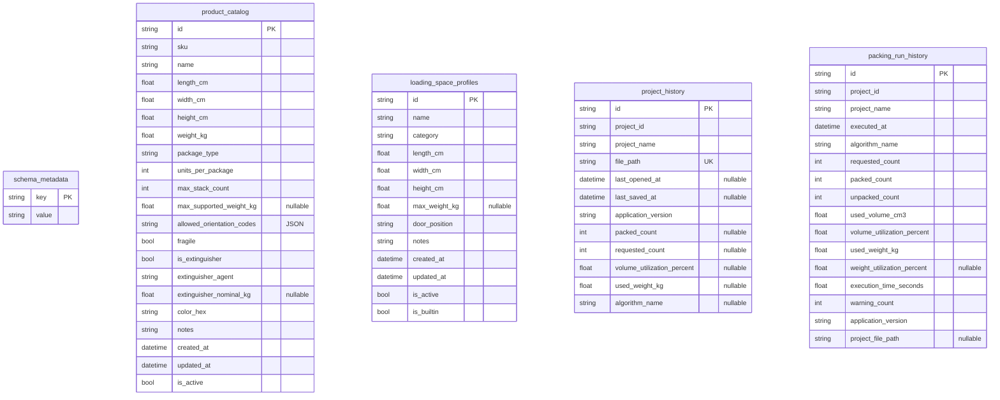

# Base de datos: catálogo, perfiles e historial (SQLite, fase 7.1)

Este documento describe `infrastructure/database/`: la base SQLite
que hace reutilizable entre proyectos lo que antes solo vivía dentro
de un archivo `.cargo3d` concreto — productos de catálogo, perfiles de
espacio de carga e historial básico de proyectos y ejecuciones.

## 1. Propósito

La fase 7.0 (`docs/ProjectFiles.md`) resolvió "guardar y reabrir **un**
proyecto completo". Esta fase resuelve un problema distinto:
**reutilizar** datos **entre** proyectos — un mismo producto (SKU) o un
mismo perfil de espacio de carga no deberían tener que teclearse de
nuevo cada vez que se empieza un proyecto nuevo.

## 2. Diferencias con `.cargo3d` (obligatorio no confundir)

| | SQLite (`infrastructure/database/`) | `.cargo3d` (`infrastructure/persistence/`) |
|---|---|---|
| Contiene | Catálogo global de productos, perfiles de espacio, historial de proyectos/ejecuciones | Fotografía completa y portable de **un** proyecto: espacio, productos, resultado, estado visual |
| Alcance | Todo el usuario, todos los proyectos | Un proyecto concreto |
| Ubicación | `%LOCALAPPDATA%\CargoOptimizer3D\cargo_optimizer.db`, nunca versionada ni en OneDrive por defecto | Donde el usuario decida guardar el archivo — sí puede vivir en OneDrive |
| Portabilidad | No se comparte entre máquinas por defecto | Se puede copiar/enviar/archivar libremente |
| Vínculo con el proyecto | **Ninguno**: al copiar un producto/perfil del catálogo a un proyecto se genera una copia independiente con un UUID nuevo | El archivo *es* el proyecto |

Un proyecto **nunca** depende de que una fila del catálogo siga
existiendo: `CatalogService.copy_to_project`/`copy_profile_to_project`
generan una copia desconectada (`dataclasses.replace(..., id=uuid4())`)
en el momento de añadirla — cambios futuros en el catálogo (editar,
archivar, incluso borrar la fila) nunca alteran un proyecto ya guardado
que use esos datos.

## 3. Ubicación de la base y `get_user_database_path`

```python
def get_user_database_path(*, base_dir: Path | None = None) -> Path: ...
```

Por defecto: `%LOCALAPPDATA%\CargoOptimizer3D\cargo_optimizer.db`,
creando el directorio si falta. `base_dir` permite a los tests apuntar
a un directorio temporal — la suite de pruebas nunca toca la base real
del usuario. No depende de Qt (no usa `QStandardPaths`): es un módulo
de `infrastructure`, puro Python + `pathlib`.

La base **no se versiona** (añadida a `.gitignore`) y no debe residir
dentro de una carpeta sincronizada por OneDrive por defecto — los
archivos `.cargo3d` sí pueden guardarse ahí, la base del catálogo no.

## 4. Esquema



No hay claves foráneas entre estas tablas: `project_id`/`project_file_path`
son referencias por valor (UUID/ruta), no relaciones declaradas en
SQLAlchemy — cada tabla es independiente porque cada una tiene un
ciclo de vida propio (un producto de catálogo no deja de existir si se
borra un proyecto; el historial no debe bloquear el borrado de nada).

`allowed_orientation_codes` se guarda como una cadena JSON
(`["lwh_xyz", "wlh_xyz", ...]`) — nunca `pickle`.

## 5. Versionado de esquema

`schema_metadata` guarda una única fila (`key="schema_version"`, hoy
`value="1"`). `schema_version` (versión del **esquema de la base**) es
un concepto distinto de `application_version` (qué build de
CargoOptimizer3D se ejecuta) — la compatibilidad se decide siempre por
la primera, nunca comparando la segunda.

`_ensure_supported_schema_version` en `migrations.py` es el único
punto de extensión: hoy solo acepta `"1"`. Una base con una versión no
reconocida (más nueva que la que la aplicación soporta) se rechaza con
`DatabaseMigrationError` — nunca se adivina el formato ni se modifica
la base. Añadir una versión futura exige escribir la migración real
(`_migrate_1_to_2(engine)` o similar), no solo ampliar el conjunto de
versiones aceptadas.

## 6. `DatabaseManager`

```python
class DatabaseManager:
    def __init__(self, db_path: Path) -> None: ...
    def initialize(self) -> None: ...
    def session_scope(self) -> AbstractContextManager[Session]: ...
    def schema_version(self) -> str | None: ...
    def health_check(self) -> DatabaseHealth: ...
    def backup(self, destination: Path | None = None) -> Path: ...
    def close(self) -> None: ...
```

- **Sesiones siempre cortas**: `session_scope()` es un *context
  manager* que abre una `Session` nueva, hace `commit()` si el bloque
  termina sin excepción, `rollback()` si la hay, y siempre `close()` al
  final. Nunca se comparte una `Session` entre operaciones ni entre
  hilos — cada método de cada repositorio abre y cierra la suya.
- **PRAGMA de SQLite** configurados en la conexión:
  `foreign_keys=ON`, `journal_mode=WAL` (mejor concurrencia
  lectura/escritura para una app de escritorio), `busy_timeout=5000`
  (evita fallos inmediatos si dos operaciones cortas coinciden).
- **`backup(destination=None)`** usa la API de backup de `sqlite3`
  (`Connection.backup(...)`), no una copia de archivo a pelo — segura
  incluso con la base en uso, a diferencia de copiar el `.db` con
  `shutil.copyfile` mientras SQLite pudiera tener escrituras
  pendientes en el WAL. Sin destino explícito, genera
  `cargo_optimizer_backup_<AAAAMMDDHHMMSS>.db` junto a la base
  original. No hay backups automáticos en cada operación — el usuario
  los dispara desde Herramientas → Crear copia de seguridad de la base
  de datos (o programáticamente).
- **`health_check()`** nunca lanza: siempre devuelve
  `DatabaseHealth(ok: bool, detail: str)`, usado tanto para el modo
  limitado al arrancar como para diagnóstico posterior.

## 7. Modelos ORM (`orm_models.py`)

SQLAlchemy 2.x, estilo declarativo (`Mapped`/`mapped_column`).
Completamente separados de `domain`: ninguna clase ORM se expone fuera
de `infrastructure` — `repositories.py` convierte explícitamente,
campo a campo, entre cada modelo ORM y su entidad de dominio
equivalente (`LoadUnit`, `LoadingSpace`) o un DTO de historial propio
(`ProjectHistoryEntry`, `PackingRunHistoryEntry`). Nunca `__dict__` ni
mapeo automático.

## 8. Repositorios

- **`ProductCatalogRepository`**: `add`/`update`/`get_by_id`/
  `get_by_sku`/`list_active`/`list_all`/`search`/`archive`/`restore`/
  `duplicate`/`count_active`. SKU único **entre productos activos**
  (comparación case-insensitive vía `func.lower(...)` en la consulta,
  no una restricción `UNIQUE` de columna — el archivado libera el SKU
  para reutilizarlo). Nunca borra físicamente: `archive`/`restore`
  alternan `is_active`.
- **`LoadingSpaceProfileRepository`**: mismo patrón sobre
  `LoadingSpace`, con nombre en vez de SKU como clave de unicidad, más
  `ensure_builtin_profiles()` (crea los tres perfiles integrados —
  contenedor 20', 40' y 40' HQ — solo si faltan, idempotente) y la
  protección explícita de que un perfil `is_builtin=True` no se puede
  `update()` directamente (`RepositoryError`): hay que duplicarlo como
  personalizado primero.
- **`ProjectHistoryRepository`**: `record_open`/`record_save` hacen
  *upsert* por `file_path` (una fila por proyecto, no una por evento);
  `list_recent(limit)` ordena por `coalesce(last_saved_at,
  last_opened_at)` descendente; `remove_missing_paths()` limpia
  entradas cuyo archivo ya no existe en disco; `clear()` vacía la
  tabla. Nunca duplica el JSON completo del `.cargo3d`.
- **`PackingRunHistoryRepository`**: `record_run` inserta una fila
  nueva por cada ejecución (a diferencia del historial de proyectos,
  aquí sí interesa conservar cada ejecución por separado);
  `list_for_project`/`list_recent`/`clear_for_project`. Guarda
  únicamente las métricas agregadas del `PackingResult`
  (`requested_count`, `packed_count`, `used_volume_cm3`,
  `volume_utilization_percent`, etc.) — nunca los `Placement`
  individuales ni ningún estado de VTK/PyVista.

Todos los repositorios reconstruyen la entidad de dominio a partir de
la fila ORM pasando por el propio constructor de `domain`
(`LoadUnit(...)`/`LoadingSpace(...)`), así que una fila corrupta se
detecta como `RepositoryError` con la causa original encadenada
(`raise ... from exc`), nunca como un `AttributeError` críptico más
adelante.

## 9. `CatalogService`

Fachada única que `presentation` usa para todo lo de esta fase:

```python
class CatalogService:
    products: ProductCatalogRepository
    profiles: LoadingSpaceProfileRepository
    project_history: ProjectHistoryRepository
    run_history: PackingRunHistoryRepository

    @classmethod
    def create_default(cls, *, base_dir: Path | None = None) -> CatalogService: ...
    def health_check(self) -> DatabaseHealth: ...
    @staticmethod
    def copy_to_project(load_unit: LoadUnit) -> LoadUnit: ...
    @staticmethod
    def copy_profile_to_project(space: LoadingSpace) -> LoadingSpace: ...
    def close(self) -> None: ...
```

No reimplementa nada de los repositorios (evita duplicación); añade
solo lo que no encaja en ninguno por sí solo: la copia independiente
hacia un proyecto (sección 2).

## 10. Modo limitado (la base nunca puede tirar la aplicación)

Al arrancar (`app.py::_initialize_catalog_service`), `CatalogService.create_default()`
se ejecuta dentro de un `try`/`except DatabaseError`. Si falla (disco
lleno, permisos, archivo corrupto, versión de esquema futura), la
aplicación:

1. Abre igualmente (`MainWindow` recibe `catalog_service=None`,
   `catalog_error=<mensaje>`).
2. Muestra un único `QMessageBox.warning` informando la causa técnica
   real — nunca oculta el motivo, nunca fuerza un cierre.
3. Deshabilita las acciones de catálogo/perfiles/historial
   (`MainWindow._apply_catalog_availability`).
4. Sigue permitiendo crear/abrir/guardar proyectos `.cargo3d`,
   editar productos y el espacio de carga, y optimizar con
   normalidad — la fase 7.0 es completamente independiente de esta.

Los tres puntos de registro de historial
(`_record_project_open_history`/`_record_project_save_history`/
`_record_run_history`) atrapan `DatabaseError` individualmente y solo
añaden un aviso al registro (`LogPanel`) — un fallo de historial
**nunca** impide guardar, abrir u optimizar.

## 11. Integración con `MainWindow`

- **Productos**: `Catálogo de productos…` (listar/buscar/CRUD/añadir
  al proyecto), `Añadir desde catálogo…` (mismo diálogo), `Guardar
  seleccionado en catálogo` (crear si el SKU no existe; si existe,
  preguntar Actualizar / Guardar con otro SKU / Cancelar — nunca
  sobrescribe en silencio).
- **Espacio de carga**: `Perfiles guardados…` (listar/buscar/CRUD/
  aplicar), `Guardar espacio como perfil…` (mismo patrón
  Actualizar/Duplicar con otro nombre/Cancelar que productos; un
  perfil integrado nunca se ofrece para "Actualizar" directamente).
- Añadir productos desde el catálogo o aplicar un perfil pasa siempre
  por los mismos métodos que ya disparan el seguimiento de cambios de
  la fase 7.0 (`ProductTableModel.add_units`/
  `LoadingSpaceFormPanel.set_loading_space`): el proyecto se marca
  modificado y, si había un resultado previo, se invalida
  automáticamente — mismo mecanismo, sin código nuevo.
- SKU duplicado al añadir desde el catálogo: se omite ese producto y
  se informa con un `QMessageBox.warning` listando los SKU omitidos —
  nunca se añade una fila con un SKU que colisiona con el proyecto
  actual.
- Historial: se registra automáticamente al abrir/guardar un
  `.cargo3d` y al terminar una optimización con éxito (no al
  cancelarla) — sin ninguna interfaz de usuario dedicada en esta fase
  (explícitamente fuera de alcance, ver sección 16 del encargo).
- `MainWindow.closeEvent` llama a `CatalogService.close()` (dispone el
  motor de SQLAlchemy) junto a la limpieza ya existente del visor 3D y
  del hilo de optimización.

## 12. Seguridad

- Todas las consultas usan la API expresiva de SQLAlchemy
  (`select(...)`, `func.lower(...)`, parámetros vinculados) — nunca se
  concatena SQL a partir de datos de entrada del usuario.
- Nunca se guardan objetos ejecutables ni se usa `pickle`.
- No se guardan secretos ni credenciales en esta base.
- Transacciones explícitas por operación (`session_scope`), con
  `rollback()` automático ante cualquier excepción.

## 13. Pruebas

`tests/infrastructure/database/`: inicialización, versión de esquema,
versión futura (`DatabaseMigrationError`), PRAGMA `foreign_keys`,
`session_scope` (commit y rollback), backup (destino por defecto y
explícito), base corrupta, catálogo (CRUD, búsqueda case-insensitive,
SKU duplicado, archivado/restauración, duplicado, extintores
individuales y grupales, Unicode, orden determinista, round-trip ORM
↔ dominio), perfiles (builtin, protección contra sobrescritura,
duplicado, búsqueda), historial (upsert de proyecto, límite y orden de
`list_recent`, `remove_missing_paths`, historial de ejecuciones por
proyecto). `tests/presentation/desktop/`: modelos de tabla, diálogos de
edición (sin llamar nunca a `.exec()` — se prueban sus métodos
internos directamente), diálogos de lista (con un catálogo SQLite real
y temporal, sustituyendo el diálogo hijo de edición por un doble de
prueba), integración completa en `MainWindow` (modo limitado, aviso de
error, flujos de guardar/actualizar/duplicar producto y perfil,
registro de historial con un `CatalogService` real, cierre limpio).

## 14. Evolución futura

- Un panel de historial visible (listar proyectos recientes con
  métricas, ejecuciones por proyecto) — hoy solo se registra, sin UI
  dedicada, según lo acordado para esta fase.
- Restauración completa de la base desde un backup vía interfaz (hoy
  solo `backup()`, sin `restore()` expuesto a la UI).
- Migraciones reales de esquema cuando aparezca una versión `"2"`.
- Posible framework de migraciones (Alembic) si la complejidad futura
  lo justifica — deliberadamente no incluido en esta fase.
