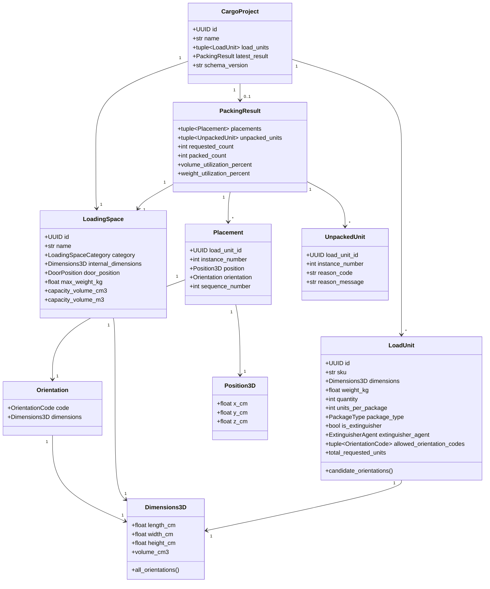

# Modelo de dominio (Fase 2)

Este documento describe el modelo de dominio puro de CargoOptimizer3D:
entidades, value objects, enums e invariantes. Todo vive en
`src/cargo_optimizer/domain/` y no depende de ninguna capa externa
(ver ADR-0001) ni de ninguna biblioteca de UI, persistencia, ofimática
o visualización (ver ADR-0003). No incluye motor geométrico, de
restricciones ni de optimización: esos llegan en fases posteriores.

## Diagrama

## Sistema de coordenadas y unidades

Todas las dimensiones y posiciones se expresan en **centímetros**.

- **X** = largo del Loading Space.
- **Y** = ancho.
- **Z** = altura.
- El origen `(0, 0, 0)` está en el suelo, en la esquina **trasera
  izquierda**.
- X crece desde la parte trasera hacia la puerta frontal de carga.
- Y crece desde la izquierda hacia la derecha.
- Z crece desde el suelo hacia arriba.

Todas las dimensiones deben ser estrictamente mayores que cero; todos
los pesos deben ser mayores o iguales a cero. Ninguna coordenada ni
dimensión puede ser `NaN` o infinita.

## Value objects

### `Dimensions3D`

Medidas físicas de una caja ortogonal (`length_cm`, `width_cm`,
`height_cm`). No asigna todavía ninguna dimensión a un eje espacial:
eso es responsabilidad de `Orientation`. Calcula volumen en cm³ y m³, y
genera sus seis permutaciones ortogonales (`all_orientations()`),
deduplicadas cuando dos o tres dimensiones coinciden.

### `OrientationCode` (enum) y `Orientation`

`OrientationCode` enumera las seis permutaciones posibles de
`(length, width, height)` sobre `(X, Y, Z)`. El nombre de cada valor
codifica explícitamente la transformación — p. ej. `WLH_XYZ` significa
`width→X, length→Y, height→Z` — documentado en detalle en el
docstring de `enums.py`.

`Orientation` combina un `OrientationCode` con las `Dimensions3D` ya
rotadas: `orientation.dimensions.length_cm` es la extensión resultante
en X, `.width_cm` en Y y `.height_cm` en Z (expuesto también como
`x_size_cm`/`y_size_cm`/`z_size_cm`). No contiene lógica de colisión:
eso pertenece al motor geométrico.

### `Position3D`

Posición de la esquina de origen de un `Placement`. Valores finitos y
mayores o iguales a cero.

## Entidades

### `LoadingSpace`

Cualquier espacio de carga (ver ADR-0002): contenedor, camión, van,
semirremolque, bodega, rack o categoría personalizada
(`LoadingSpaceCategory.OTHER`). Nunca asume que representa
específicamente un contenedor marítimo. Incluye perfiles predefinidos
orientativos (`standard_20ft_container`, `standard_40ft_container`,
`standard_40ft_high_cube_container`) cuyas dimensiones reales **varían
según fabricante y operador** — son puntos de partida editables, no
valores autoritativos.

### `LoadUnit`

Cualquier unidad de carga (ver ADR-0002): caja, pallet, tambor,
cilindro, maquinaria, carga irregular o extintor. Deja preparados los
campos de extintor (`is_extinguisher`, `extinguisher_agent`,
`extinguisher_nominal_kg`) para que el motor de restricciones (fase 3)
pueda aplicar la regla de horizontalidad obligatoria; esa regla **no**
se implementa en esta fase.

**Distinción importante — tres cantidades que se confunden con
facilidad:**

| Campo | Significado |
|---|---|
| `quantity` | Número de paquetes físicos solicitados. |
| `units_per_package` | Unidades individuales dentro de cada paquete (relevante para `grouped_box`: p. ej. una caja con 12 unidades). |
| `total_requested_units` | `quantity * units_per_package`: el total real de unidades individuales. |

Un `package_type = individual` siempre tiene `units_per_package = 1`
(no tiene sentido "un paquete individual de 3 unidades"); un
`grouped_box` sí puede tener `units_per_package > 1`.

**Distinción importante — peso nominal del extintor vs. peso bruto del
empaque:** `weight_kg` es el peso bruto de un paquete tal como se
carga (incluyendo el propio extintor, su soporte, embalaje, etc.).
`extinguisher_nominal_kg` es un dato distinto: la carga nominal del
agente extintor (p. ej. "6 kg de PQS"), relevante para las reglas de
extinción de incendios de la fase 3, no para el cálculo de peso total
de la carga.

**Distinción importante — `LoadUnit` vs. unidad física expandida:** un
`LoadUnit` es la *especificación* de un tipo de paquete y cuántos se
piden (`quantity`). Cuando el motor de optimización (fase 4) intente
colocarlos, cada una de esas `quantity` instancias físicas se
representará como un `Placement` (si se colocó) o un `UnpackedUnit`
(si no cupo), identificado por `load_unit_id` + `instance_number`. El
`LoadUnit` en sí nunca se "coloca": lo que se coloca son sus instancias
físicas.

### `Placement`

Dónde y cómo queda una instancia física concreta de un `LoadUnit`:
posición de su esquina de origen, orientación aplicada y el orden
(`sequence_number`) en que el algoritmo la colocó. No detecta
colisiones: eso es del motor geométrico.

### `UnpackedUnit`

Registra que una instancia física de un `LoadUnit` no pudo colocarse,
con un código y un mensaje de motivo.

### `PackingResult`

Resultado completo de un intento de optimización: qué se colocó, qué
no, y las métricas de utilización (volumen, peso, porcentaje de
completitud). Este modelo solo define la estructura; construirlo a
partir de una ejecución real del optimizador es responsabilidad de la
fase 4.

### `CargoProject`

Agregado raíz: un `LoadingSpace`, el conjunto de `LoadUnit` a cargar
(sin SKUs duplicados) y, opcionalmente, el último `PackingResult`.
`schema_version` arranca en `"1.0"` como valor estable de cara a la
futura persistencia (fase 7).

## Enums

Ver `src/cargo_optimizer/domain/enums.py` para el detalle completo de
cada valor. Todos heredan de `enum.StrEnum` (ver ADR-0005): sus valores
string son parte del contrato estable de persistencia y API futura.

- `LoadingSpaceCategory`: `container`, `truck`, `van`, `trailer`,
  `warehouse`, `rack`, `other`.
- `DoorPosition`: `front`, `rear`, `left`, `right`, `top`,
  `unrestricted`.
- `PackageType`: `individual`, `grouped_box`, `pallet`, `drum`,
  `cylinder`, `irregular_bounding_box`, `other`.
- `ExtinguisherAgent`: `pqs`, `co2`, `water`, `foam`, `wet_chemical`,
  `clean_agent`, `other`, `not_applicable`.
- `OrientationCode`: `lwh_xyz`, `wlh_xyz`, `lhw_xyz`, `hwl_xyz`,
  `whl_xyz`, `hlw_xyz`.

## Excepciones de dominio

`domain/exceptions.py` define una jerarquía pequeña y deliberada:

- `DomainError`: raíz de cualquier violación de una regla de dominio.
- `DomainValidationError`: un valor no cumple una invariante de un
  value object o entidad.
- `DuplicateSkuError`: un `CargoProject` recibió más de un `LoadUnit`
  con el mismo SKU.

## Lo que esta fase NO implementa

- Motor geométrico ni detección de colisiones.
- Algoritmo de packing ni de optimización.
- La regla de restricción de horizontalidad de extintores (fase 3).
- Visualización 3D, persistencia SQLite, exportación Excel/PDF, API.
