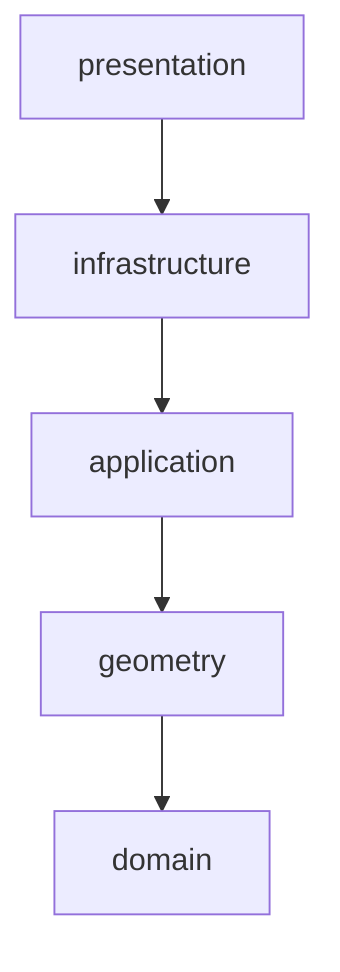

# Motor geométrico (Fase 2.2)

## Propósito

`cargo_optimizer.geometry` realiza cálculos espaciales deterministas
sobre las entidades del dominio: cajas ortoédricas, límites, colisiones,
soporte físico, puntos candidatos y validación de layouts completos.

## Límites de responsabilidad

Este paquete **no implementa**:

- algoritmo de packing ni heurísticas de optimización (fase 4);
- reglas específicas de negocio, p. ej. horizontalidad obligatoria de
  extintores (fase 3);
- peso máximo, fragilidad, orientación permitida ni orden de descarga
  como reglas de validación (fase 3/4 — `validate_layout` no las
  comprueba);
- interfaz gráfica ni visualización VTK (fases 5/6);
- persistencia, Excel, PDF ni API (fases 7/8/9).

Solo geometría tridimensional rectangular, validación espacial y
soporte físico básico (sin centro de gravedad ni vuelco).

## Dependencia exclusiva de `domain`

`geometry` depende únicamente de `cargo_optimizer.domain`. Nunca
importa `application`, `infrastructure`, `presentation`, PySide6,
SQLAlchemy, openpyxl, VTK ni ReportLab. Verificado automáticamente con
`import-linter` (contrato `layers` en `pyproject.toml`). Ver ADR-0006.

## Sistema de coordenadas

El mismo que en `domain` (ver `docs/DomainModel.md`), sin ninguna
modificación: X = largo, Y = ancho, Z = alto; centímetros; origen
`(0, 0, 0)` en el suelo, esquina trasera izquierda; X crece hacia la
puerta frontal; Y crece de izquierda a derecha; Z crece hacia arriba.

## Tolerancia

`GEOMETRY_EPSILON_CM = 1e-9` (en `geometry/constants.py`) es la única
tolerancia usada en todas las comparaciones geométricas sensibles del
paquete. Ver ADR-0006, Decisión 2.

## Contacto vs. colisión

Tres relaciones distintas entre dos `AxisAlignedBox`:

| Relación | Significado | Dos cajas apiladas cara con cara |
|---|---|---|
| `overlaps` | Intersección con volumen **estrictamente positivo** | `False` |
| `touches` | Contacto (cara, arista o vértice) **sin** volumen de intersección | `True` |
| `intersects` | Cualquiera de los dos casos anteriores (test AABB estándar) | `True` |

`boxes_overlap` (usado por la detección de colisiones) se basa en
`overlaps`: **tocarse no cuenta como colisión**. Ver ADR-0006,
Decisión 3.

## Soporte físico

Una caja en `z ≈ 0` (con tolerancia) está soportada por el suelo con
`support_ratio = 1.0`. Una caja sobre otras está soportada cuando su
base horizontal se solapa con la cara superior de una o más cajas
inferiores a, aproximadamente, la misma altura. El área de soporte se
calcula como la **unión** (no la suma) de los rectángulos de solape,
para no contar dos veces las zonas en las que varias cajas inferiores
se solapan bajo la candidata. `is_supported` exige por defecto
`minimum_support_ratio = 1.0` (soporte completo) en esta primera
versión. No se considera centro de gravedad ni vuelco.

## Área de unión de rectángulos

`geometry/rectangles.py` implementa `union_area_cm2` mediante
compresión de coordenadas en X (barrido de franjas verticales, fusión
de intervalos Y por franja). No se usa Shapely ni ninguna otra
dependencia externa: es una implementación mínima, correcta y legible.

## Puntos candidatos

`generate_candidate_positions` genera, a partir de un conjunto de
`Placement`, el origen y tres puntos "esquina" por cada caja ya
colocada (final de su extensión en X, en Y, y su cara superior en Z).
No filtra por límites ni por colisiones, y no aplica ninguna
heurística: es preparación geométrica para el futuro motor de
optimización (fase 4), no optimización en sí.

## Validación de layouts

`validate_layout` combina límites, colisiones, soporte y duplicados de
`instance_number`/`sequence_number` en un único `LayoutValidationResult`
con una lista de `LayoutValidationIssue` (código, mensaje,
`sequence_number`s afectados). No verifica peso máximo, reglas de
extintores, fragilidad, orientación permitida ni orden de descarga.

## Limitaciones actuales y complejidad temporal

- **Colisiones**: `find_overlapping_placements` es O(n²) — compara
  cada par de `Placement`. Correcto y suficientemente rápido para los
  volúmenes de datos de esta fase (decenas/cientos de unidades).
- **Soporte**: por cada candidata, se examinan todas las cajas ya
  colocadas a la misma altura; la unión de rectángulos resultante es,
  en el peor caso, O(k² ) para k rectángulos bajo esa candidata.
- **Puntos candidatos**: la deduplicación por tolerancia es O(n²) sobre
  el número de puntos generados.

## Evolución futura hacia estructuras espaciales

Si el volumen de datos de un proyecto real lo exige, estas
implementaciones O(n²) pueden sustituirse por estructuras espaciales
(p. ej. un R-tree o una rejilla uniforme) sin cambiar las firmas
públicas documentadas en `geometry/__init__.py`: los llamadores
(motor de restricciones, motor de optimización) seguirían funcionando
igual.
