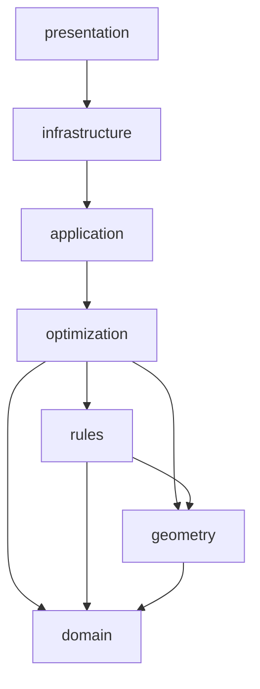

# Diseño del motor de optimización (Fase 4.0)

Este documento es el diseño original de la fase 4.0, conservado tal
cual para el historial. **La implementación real (fase 4.1) ya existe:
ver `docs/OptimizationEngine.md`**, que documenta qué se construyó de
verdad, dónde coincide con este diseño y dónde se apartó (p. ej. el
rendimiento medido resultó bastante peor de lo estimado aquí — ver la
sección "Rendimiento" de ese documento). Este archivo ya no se
actualiza; los cambios de comportamiento real se documentan en
`docs/OptimizationEngine.md`.

## Propósito

Un motor que recibe un `LoadingSpace` y una colección de `LoadUnit`, y
produce un `PackingResult` colocando tantas instancias físicas como
sea posible, respetando siempre las reglas de `cargo_optimizer.rules`.
No decide reglas de negocio (eso ya existe); decide **dónde** colocar
cada instancia y **en qué orden**. Debe funcionar igual para un
contenedor marítimo, un camión, una bodega o un espacio personalizado:
ninguna lógica aquí puede asumir que el espacio es un "contenedor".

## Responsabilidades y límites

El motor:

- expande `LoadUnit` (con `quantity`) en instancias físicas individuales;
- decide un orden de intento;
- genera posiciones candidatas usando `geometry`;
- obtiene orientaciones permitidas y valida cada candidato usando `rules`;
- puntúa candidatos válidos y elige uno;
- construye un `PackingResult`.

El motor **no**:

- valida ni reinterpreta reglas de negocio (eso es de `rules`);
- calcula geometría de bajo nivel (eso es de `geometry`);
- conoce PySide6, SQLAlchemy, openpyxl, VTK ni ReportLab;
- persiste nada;
- dibuja nada;
- decide la arquitectura de la interfaz.

## Arquitectura: `optimization` como capa propia



`src/cargo_optimizer/optimization/` será hermano de `domain`,
`geometry`, `rules`, `application`, `infrastructure` y `presentation`.

Dependencias permitidas: `optimization → domain`, `optimization →
geometry`, `optimization → rules`. Prohibidas: `optimization →
application`, `optimization → infrastructure`, `optimization →
presentation`, y cualquier biblioteca externa (PySide6, SQLAlchemy,
openpyxl, VTK, ReportLab). Cuando el paquete se cree (Fase 4.1), el
contrato de `import-linter` se actualizará a:

```
presentation → infrastructure → application → optimization → rules → geometry → domain
```

**Esta sesión no crea el paquete.** Crear `optimization/` vacío o con
solo firmas especulativas violaría la misma regla que ya aplicamos a
`geometry` y `rules` en fases anteriores: no se crea estructura antes
de que exista contenido real que la llene (ver `docs/Roadmap.md`).

## Componentes

Cada componente se decide de forma explícita: qué es, por qué existe
(o por qué no existe todavía), y si es clase, función o dataclass. La
lista original del encargo se usa como punto de partida, no como
verdad final — ver la sección "Decisiones que se apartan del enunciado"
al final de cada componente donde aplica.

### `PackingEngine` — fachada, clase sin estado

Único punto de entrada: `PackingEngine().optimize(request,
run_control=None) -> PackingResult`. Sigue el mismo patrón que
`RulesEngine` (ADR-0007): una clase sin `__init__` propio, sin atributos
de instancia, cuyos métodos son delegaciones. Responsabilidades:
validar la solicitud, expandir unidades, resolver qué `PackingStrategy`
usar, medir el tiempo total de ejecución, invocar la estrategia,
ejecutar la validación final del layout (`geometry.layout_validation`),
y construir el `PackingResult`. No contiene ninguna heurística de
colocación — eso vive exclusivamente en la estrategia elegida.

### `PackingStrategy` — contrato, `Protocol` (no `ABC`)

```python
class PackingStrategy(Protocol):
    name: str

    def capabilities(self) -> StrategyCapabilities: ...

    def pack(
        self,
        request: PackingRequest,
        instances: tuple[PhysicalLoadInstance, ...],
        state: PackingState,
        rules_engine: RulesEngine,
        run_control: PackingRunControl,
    ) -> None: ...  # muta `state` en el sitio; no retorna nada
```

**Por qué `Protocol` y no `ABC`:** no existe todavía ningún
comportamiento compartido entre estrategias que justifique una clase
base con métodos concretos (no hay "template method" que reutilizar).
Un `Protocol` permite tipar estructuralmente sin forzar herencia: una
estrategia futura puede ser una clase normal, un objeto construido con
`functools.partial`, o incluso una clase de test mínima, sin heredar de
nada del paquete. Si en el futuro aparece lógica genuinamente
compartida entre 2+ estrategias (p. ej. un bucle común de "probar
orientaciones × posiciones"), esa lógica se extrae a una función libre
reutilizable por composición, no a una superclase — evita la trampa
clásica de una jerarquía de herencia que ninguna estrategia real
termina encajando limpiamente.

`StrategyCapabilities` (dataclass inmutable pequeña) declara metadatos
que el motor puede inspeccionar antes de ejecutar: `is_deterministic:
bool`, `supports_cancellation: bool`, `supports_time_limit: bool`. Esto
permite que `PackingEngine` rechace, por ejemplo, un `random_seed`
distinto de `None` si la estrategia elegida no es estocástica, en vez
de ignorarlo silenciosamente.

### `PackingRequest` — dataclass inmutable

Campos de la primera versión (Fase 4.1):

```python
@dataclass(frozen=True, slots=True)
class PackingRequest:
    loading_space: LoadingSpace
    load_units: tuple[LoadUnit, ...]
    strategy_name: str = "greedy_extreme_point_v1"
    minimum_support_ratio: float = 1.0
    time_limit_seconds: float | None = None
    max_iterations: int | None = None
    random_seed: int | None = None
    metadata: Mapping[str, str] = field(default_factory=dict)
```

`strategy_name` es un `str`, no un objeto `PackingStrategy`: mantiene
`PackingRequest` serializable (persistencia futura, fase 7) sin
necesitar volcar un callable. `PackingEngine` resuelve el nombre a una
instancia mediante un registro interno simple (un `dict[str,
PackingStrategy]` construido en el módulo, no un sistema de plugins).

**Campos que quedan fuera de v1, deliberadamente:** `stop_when_all_packed`
(solo tendría sentido con una estrategia que pueda decidir parar antes
de agotar las instancias; Greedy siempre las procesa todas una vez, así
que el campo no tendría efecto — se añadirá cuando exista una
estrategia que lo necesite) y `objective_weights` (Fase 4.1 no usa
suma ponderada de objetivos — ver sección "Objetivos" — así que un
campo que nadie leería sería un campo especulativo, prohibido
explícitamente en el encargo).

### `PackingState` — mutable, interno, nunca expuesto

Único objeto verdaderamente mutable de todo el motor. Se crea al
principio de `optimize()`, se pasa por referencia a la estrategia, y se
descarta después de construir el `PackingResult`. **Nunca se exporta**
desde `optimization/__init__.py` ni se devuelve al llamador.

No expone listas públicas directamente mutables: expone métodos de
mutación controlados (`accept_placement(candidate) -> Placement`,
`reject_instance(instance, reason, message)`,
`next_sequence_number() -> int`) para que una estrategia no pueda, por
accidente, reutilizar un `sequence_number` o dejar el estado
inconsistente. Campos internos: `placements: list[Placement]`,
`unpacked: list[UnpackedUnit]`, `warnings: list[str]`,
`_sequence_counter: int`, `iteration_count: int`.

**Decisión importante:** `PackingState` **no** mantiene
`packed_weight_kg` ni `packed_volume_cm3` como totales acumulados en
vivo. Se calculan una sola vez, al final, a partir de `placements`
(sumando `orientation.dimensions.volume_cm3` y el `weight_kg` del
`LoadUnit` correspondiente). Mantener un total en vivo *además* de la
lista de placements sería una segunda fuente de verdad que podría
desincronizarse; se prefiere derivarlo siempre, una vez, al construir
el resultado (`PackingResultBuilder`).

Las posiciones candidatas (`geometry.generate_candidate_positions`) no
se cachean como campo de `PackingState`: se recalculan a partir de
`state.placements` cuando la estrategia las necesita. Ver "Rendimiento"
para el coste de esta decisión y su evolución futura.

### `PhysicalLoadInstance` — dataclass inmutable

```python
@dataclass(frozen=True, slots=True)
class PhysicalLoadInstance:
    load_unit: LoadUnit
    instance_number: int
    requested_order: int
    priority: int = 0
    stable_id: str = ""  # f"{load_unit.sku}#{instance_number}", solo para logs/trazas
```

Distinción explícita (ver también `docs/DomainModel.md`):

| Concepto | Qué es |
|---|---|
| SKU | Identificador de texto de un tipo de paquete (`LoadUnit.sku`) |
| `LoadUnit` | La especificación de un tipo de paquete: dimensiones, peso, reglas, y cuántos se piden (`quantity`) |
| `quantity` | Cuántos paquetes físicos de ese tipo se solicitan |
| `units_per_package` | Cuántos ítems individuales (p. ej. extintores) hay dentro de **un** paquete físico — irrelevante para la geometría |
| `PhysicalLoadInstance` | Un paquete físico concreto a colocar; hay `quantity` de estos por `LoadUnit` |
| Extintores dentro de una caja grupal | Nunca se colocan por separado: una caja grupal con 10 extintores es **una** `PhysicalLoadInstance`, una caja geométrica |

### `LoadUnitExpander` — función libre, no clase

```python
def expand(load_units: Sequence[LoadUnit]) -> tuple[PhysicalLoadInstance, ...]: ...
```

Sin estado, sin polimorfismo necesario: no hay razón para una clase.
Recorre `load_units` en el orden de entrada; por cada uno, genera
`quantity` instancias con `instance_number` de 1 a `quantity` y
`requested_order` como contador global creciente (preserva el orden de
entrada completo, no solo dentro de cada `LoadUnit`). **No** asigna
`priority` de negocio — eso es responsabilidad de una función de
ordenación separada (ver sección 7), manteniendo una única
responsabilidad: expandir cantidades, no decidir prioridades. No
modifica ningún `LoadUnit` (son inmutables por invariante de dominio,
así que esto es automático, no solo una promesa).

### `CandidatePositionGenerator` — no se crea todavía

`geometry.generate_candidate_positions` ya es una función pura,
determinista, con una única implementación. Envolverla hoy en un nuevo
`Protocol` de "generador de posiciones intercambiable" sería
sobrearquitectura especulativa: no existe todavía una segunda
implementación real que justifique la abstracción (YAGNI). La
estrategia llama directamente a `geometry.generate_candidate_positions`.

**Regla explícita para el futuro:** cuando se implemente una segunda
estrategia de generación de puntos (espacios libres, skyline — ver
Fase 4.x), **entonces** se introduce un `Protocol` con un método
`generate(state) -> tuple[Position3D, ...]`, no antes.

### `OrientationProvider` — función + caché, no clase

`RulesEngine.allowed_orientations(load_unit, loading_space)` depende
únicamente de `load_unit` y `loading_space`, nunca de la instancia
física concreta ni de la posición candidata. Esto permite un caché
trivial construido una vez por ejecución: un `dict[UUID,
tuple[Orientation, ...]]` (o `dict[UUID, RuleEvaluation]` si se
memoiza el resultado completo) indexado por `load_unit.id`, para no
recalcular orientaciones cientos de veces cuando `quantity` es alto.
Esto **no** es un `Protocol` ni una clase con jerarquía: es una función
`get_orientations(load_unit, loading_space, rules_engine, cache) ->
tuple[Orientation, ...]` con un diccionario mutable pasado
explícitamente (o encapsulado en un objeto muy pequeño,
`OrientationCache`, sin lógica más allá de "leer o calcular y guardar").

**Aclaración explícita pedida por el encargo:** el filtrado por límites
del espacio (¿la caja cabe dentro del `LoadingSpace` en esta posición?)
es responsabilidad del `CandidateEvaluator` (que ya delega en
`rules.spatial_rules.evaluate_bounds`), **no** de este proveedor. Una
orientación puede ser válida en general y aun así no caber en una
posición concreta; separar ambas preguntas evita evaluarlas dos veces.

### `CandidatePlacement` — dataclass inmutable, no entidad de dominio

```python
@dataclass(frozen=True, slots=True)
class CandidatePlacement:
    instance: PhysicalLoadInstance
    position: Position3D
    orientation: Orientation
    rule_evaluation: RuleEvaluation
    score: PlacementScore | None  # None si rule_evaluation.is_allowed es False

    def to_placement(self, sequence_number: int) -> Placement: ...
```

**Decisión importante:** no almacena un `Placement` de dominio como
campo. Construir un `Placement` para cada candidato (incluidos los
rechazados) sería instanciar y validar una entidad de dominio para
datos que nunca se aceptan — conceptualmente incorrecto (`Placement`
representa una colocación real, no un intento) y computacionalmente
innecesario. `to_placement()` se llama **solo** cuando el motor decide
aceptar el candidato, y solo entonces recibe un `sequence_number` real
(asignado por `PackingState.next_sequence_number()`).

### `CandidateEvaluator` — función libre

```python
def evaluate_candidate(
    instance: PhysicalLoadInstance,
    position: Position3D,
    orientation: Orientation,
    loading_space: LoadingSpace,
    state: PackingState,
    rules_engine: RulesEngine,
    minimum_support_ratio: float,
) -> RuleEvaluation: ...
```

Construye un `PlacementRuleContext` (traduciendo los tipos internos del
optimizador a los tipos que ya espera `rules`) y delega en
`RulesEngine.evaluate_placement`. No decide nada, no rankea nada, no
duplica bounds/collision/support/stacking/extinguisher/weight — toda
esa lógica ya existe en `rules` y `geometry`. Una función auxiliar
separada, `geometric_metrics(instance, position, orientation) ->
CandidateMetrics` (bounding box, volumen, altura de cara superior),
calcula datos puramente geométricos que el *scorer* necesitará, sin
mezclarse con la decisión de validez.

### `CandidateScorer` — función libre + dataclass de resultado

```python
@dataclass(frozen=True, slots=True)
class PlacementScore:
    sort_key: tuple[float, ...]
    breakdown: Mapping[str, float]

def score_candidate(
    position: Position3D,
    metrics: CandidateMetrics,
    generation_index: int,
) -> PlacementScore: ...
```

**Formato de score: tupla comparada lexicográficamente, no suma
ponderada.** Justificación: una suma ponderada exige calibrar
constantes arbitrarias entre magnitudes no comparables (¿1 cm menos en
Z equivale a cuántos cm² más de contacto?), es difícil de justificar,
difícil de testear de forma determinista, y un ajuste de peso puede
reordenar resultados silenciosamente sin una explicación clara. Un
orden lexicográfico (comparar el primer elemento; solo si empatan,
mirar el segundo; y así sucesivamente) es determinista por
construcción, no requiere calibración, y es directamente explicable
("A ganó porque su Z era menor"). Recomendación para v1: `sort_key =
(z, x, y, -support_ratio, generation_index)`. El último elemento
(`generation_index`, el orden en que se generó el candidato, nunca
aleatorio) garantiza un desempate total incluso si los demás
coinciden. `breakdown` es un mapa con los mismos valores nombrados,
para explicabilidad (ver esa sección), no para la comparación en sí.

Las sumas ponderadas quedan explícitamente pospuestas a una futura
estrategia multiobjetivo (p. ej. `BeamSearchStrategy`), no a Greedy
Layer v1.

### `LayerManager` — no se diseña como componente global

La estrategia recomendada para Fase 4.1 (ver
`docs/GreedyLayerStrategyDesign.md`) es una variante de *extreme-point
greedy*, que no necesita ningún concepto explícito de "capa": el nivel
de apilamiento ya lo calcula `rules.stacking_rules.count_stack_level`
a partir del soporte físico real. Introducir un `LayerManager` global
duplicaría esa noción con un criterio distinto ("índice de capa"
abstracto) que podría divergir de la fuente de verdad real del motor de
reglas — un riesgo de inconsistencia, no una simplificación. **Si**
en el futuro se implementa una variante de layering estricto, debe
vivir como una clase privada dentro de ese módulo de estrategia
concreto, nunca en el paquete público de `optimization`.

### `SpacePartition` — no se implementa en v1

v1 usa "lista de placements aceptados + regenerar puntos candidatos
desde cero cada iteración", exactamente lo que ya ofrece `geometry`.
Es O(n) por candidato para colisión/soporte, aceptable para los
volúmenes de esta fase (ver "Rendimiento"). Free boxes, maximal spaces,
extreme points como estructura persistente, spatial index, octree o
R-tree quedan explícitamente para v0.8+, cuando exista evidencia real
de que la corrección ya está resuelta y el cuello de botella es
medible.

### `PackingResultBuilder` — función libre

```python
def build(
    loading_space: LoadingSpace,
    state: PackingState,
    algorithm_name: str,
    execution_time_seconds: float,
) -> PackingResult: ...
```

Calcula `used_volume_cm3` y `used_weight_kg` sumando sobre
`state.placements` (nunca duplicando un total ya mantenido en otro
sitio — ver `PackingState`). El resto de porcentajes
(`volume_utilization_percent`, `weight_utilization_percent`,
`packing_completion_percent`) **no se recalculan aquí**: ya son
propiedades de `PackingResult` (dominio, fase 2.1); `build()` solo
provee los campos crudos que ese `@property` necesita.

### `UnpackedReason` — `enum.StrEnum`

```python
class UnpackedReason(StrEnum):
    NO_VALID_ORIENTATION = "no_valid_orientation"
    NO_FEASIBLE_POSITION = "no_feasible_position"
    LOADING_SPACE_WEIGHT_EXCEEDED = "loading_space_weight_exceeded"
    TIME_LIMIT_REACHED = "time_limit_reached"
    ITERATION_LIMIT_REACHED = "iteration_limit_reached"
    CANCELLED = "cancelled"
    INVALID_INPUT = "invalid_input"
```

**Desviación deliberada del enunciado:** no se incluyen
`unsupported` ni `stacking_restriction` como valores propios de
`UnpackedReason`. Esas ya son violaciones de regla con código estable
en `rules.codes` (`UNSUPPORTED`, `MAX_STACK_EXCEEDED`, etc.). Repetirlas
aquí duplicaría información. La distinción de tres niveles:

- **Causa final** (`UnpackedReason`, un único valor): por qué el motor
  dejó de intentar colocar esta instancia — casi siempre
  `NO_FEASIBLE_POSITION` (se probaron todas las orientaciones y
  posiciones candidatas disponibles y ninguna combinación fue válida).
- **Violaciones observadas en candidatos** (`tuple[RuleViolation,
  ...]`, detalladas, solo en modo diagnóstico): la lista de razones
  específicas por las que cada candidato concreto fue rechazado
  (`OUT_OF_BOUNDS`, `COLLISION`, `UNSUPPORTED`, etc. — ya existentes en
  `rules.codes`).
- **Advertencias** (`PackingResult.warnings`, `tuple[str, ...]`): notas
  a nivel de ejecución completa, no de una instancia concreta (p. ej.
  "la ejecución se detuvo por límite de tiempo con 40 instancias sin
  procesar").

`UnpackedUnit.reason_code` (dominio, ya existente) recibirá el valor de
`UnpackedReason`; `reason_message` llevará un mensaje humano breve.

## Flujo completo

1. Recibir `PackingRequest`.
2. Validar la solicitud (`load_units` no vacío; cada `LoadUnit` cabe en
   el `LoadingSpace` en al menos una orientación teórica — chequeo
   barato antes de intentar nada; `time_limit_seconds`/`max_iterations`
   no negativos). Si falla: `PackingRequestValidationError`, sin
   ejecutar nada más.
3. Resolver `strategy_name` a una `PackingStrategy` registrada. Validar
   `StrategyCapabilities` contra los parámetros de la solicitud (p. ej.
   `random_seed` con estrategia no estocástica → error de validación).
4. Expandir `load_units` en `PhysicalLoadInstance` (`LoadUnitExpander`).
5. Ordenar las instancias (ver sección 7).
6. Inicializar `PackingState` vacío.
7. Invocar `strategy.pack(request, instances, state, rules_engine,
   run_control)`. Dentro, por cada instancia en el orden ya fijado:
   - comprobar cancelación/límite de tiempo/iteraciones; si se activa,
     detener el bucle (no es un error, ver "Manejo de errores");
   - obtener orientaciones permitidas (`OrientationProvider`, con caché);
   - generar posiciones candidatas (`geometry.generate_candidate_positions`
     sobre `state.placements` actuales);
   - construir candidatos (instancia × orientación × posición);
   - evaluar cada uno (`CandidateEvaluator`);
   - puntuar los válidos (`CandidateScorer`);
   - elegir el candidato de menor `sort_key`;
   - si existe: `state.accept_placement(...)`;
   - si no existe: `state.reject_instance(instance,
     UnpackedReason.NO_FEASIBLE_POSITION, mensaje)`.
8. Al terminar (o al interrumpirse por tiempo/cancelación/iteraciones),
   volver a `PackingEngine`.
9. Ejecutar `geometry.layout_validation.validate_layout` sobre
   `state.placements` como verificación final de coherencia.
   - **Si detecta un problema** (p. ej. una colisión entre placements
     ya aceptados): esto es un error interno del motor, no un
     resultado parcial válido — se lanza `PackingEngineError` con el
     detalle de `LayoutValidationResult`. Un layout inconsistente
     nunca se devuelve como si fuera válido.
10. `PackingResultBuilder.build(...)` construye el `PackingResult`.
11. Devolver el resultado.

## Determinismo

Reglas concretas:

- `PackingRequest.load_units` es una `tuple`, nunca un `set`: el orden
  de entrada siempre se preserva y nunca se reordena por una
  estructura sin orden garantizado.
- La expansión (`LoadUnitExpander.expand`) preserva el orden de entrada
  y asigna `requested_order` de forma estrictamente creciente.
- El orden de empaquetado (sección 7) es una función pura de los datos
  de cada instancia, con `requested_order` como desempate final
  siempre presente — nunca queda un empate sin resolver.
- `allowed_orientations_for_load_unit` (ya existente, ya probado
  determinista) fija el orden de orientaciones.
- `geometry.generate_candidate_positions` (ya existente, ya probado
  determinista) fija el orden de posiciones.
- La combinación orientación × posición se recorre en un orden fijo y
  documentado (p. ej. orientación externa, posición interna), nunca
  `itertools.product` sobre conjuntos sin orden.
- El desempate final del *scorer* usa el índice de generación del
  candidato, nunca aleatoriedad.
- **Advertencia explícita:** no iterar directamente sobre un `set[...]`
  cuando el resultado depende de ese orden — en CPython, el orden de
  iteración de un `set` de cadenas puede variar entre ejecuciones del
  proceso por la aleatorización de hash de `str`
  (`PYTHONHASHSEED`), a diferencia de un `dict`, cuyo orden de
  inserción sí está garantizado desde Python 3.7. Cualquier colección
  cuyo orden importe debe ser explícitamente una lista o tupla
  ordenada, nunca un `set`.
- `random_seed` queda reservado para estrategias estocásticas futuras
  (Fase 4.x); Greedy Layer v1 no usa aleatoriedad en absoluto.

**Cómo se probará:** el mismo patrón ya usado en `tests/geometry` y
`tests/rules` (`test_determinism`, `test_deterministic_result`):
ejecutar `engine.optimize(request)` dos veces con el mismo `request` y
comprobar que el `PackingResult` resultante es idéntico
(`result_a == result_b`, posible porque `PackingResult` es un
`frozen dataclass`), o al menos que la secuencia de
`(sku, instance_number, position, orientation.code)` coincide
exactamente.

## Manejo de errores

| Situación | Mecanismo |
|---|---|
| Solicitud inválida (antes de ejecutar) | `PackingRequestValidationError` |
| Instancia que no cupo en ningún candidato | `UnpackedUnit` + `UnpackedReason.NO_FEASIBLE_POSITION` — resultado normal, no error |
| Límite de tiempo alcanzado a mitad de ejecución | `PackingResult` parcial + instancias restantes como `UnpackedUnit(TIME_LIMIT_REACHED)` + advertencia en `warnings` |
| Cancelación solicitada | Igual que el límite de tiempo, con `UnpackedReason.CANCELLED` |
| Límite de iteraciones alcanzado | Igual, con `ITERATION_LIMIT_REACHED` |
| Validación final del layout falla | `PackingEngineError` — indica un bug del propio motor, nunca se silencia |
| Violación de regla en un candidato concreto | `RuleEvaluation.is_allowed = False`; nunca una excepción |

Jerarquía de excepciones futura (`optimization/exceptions.py`, Fase
4.1): `OptimizationError` (base) → `PackingRequestValidationError`,
`PackingEngineError`. Mismo patrón pequeño y deliberado que
`domain.exceptions`, `geometry.exceptions`.

**Principio explícito:** nunca se usa una excepción como control de
flujo normal para "esta caja no cupo". Eso es siempre un
`UnpackedUnit`.

## Cancelación y progreso

Diseño agnóstico de framework, sin depender de Qt:

```python
class CancellationToken:
    def is_cancelled(self) -> bool: ...
    def cancel(self) -> None: ...
    # internamente: threading.Event

@dataclass(frozen=True, slots=True)
class PackingProgress:
    instances_processed: int
    instances_total: int
    packed_count: int
    elapsed_seconds: float

@dataclass(frozen=True, slots=True)
class PackingRunControl:
    cancellation: CancellationToken = field(default_factory=CancellationToken)
    progress_callback: Callable[[PackingProgress], None] | None = None
    deadline: float | None = None  # timestamp de time.monotonic()
    diagnostics: bool = False
```

`CancellationToken` es la única excepción deliberada a "todo
inmutable": la cancelación es intrínsecamente una señal mutable
cruzando hilos (la UI la activa, el motor la consulta). Se implementa
con `threading.Event` (biblioteca estándar, sin dependencias nuevas),
lo que permite que una futura `presentation/desktop` ejecute
`engine.optimize(...)` en un `QThread` y cancele desde el hilo principal
llamando `token.cancel()`, sin que `optimization` importe nada de Qt.
El bucle interno de la estrategia comprueba
`run_control.cancellation.is_cancelled()` y `time.monotonic() >=
run_control.deadline` periódicamente (barato, una comparación) y, si se
activa, deja de procesar instancias nuevas sin lanzar ninguna
excepción. `progress_callback` se invoca cada N instancias procesadas
(no en cada una, para no penalizar rendimiento), con una instantánea
inmutable.

`diagnostics: bool` vive en `PackingRunControl` (una preocupación de
"cómo ejecutar/depurar esta corrida"), no en `PackingRequest` (que
describe "qué optimizar").

## Rendimiento

| Escenario | Expectativa v1 |
|---|---|
| 10 cajas | Instantáneo |
| 100 cajas | Milisegundos a un par de segundos |
| 1.000 cajas | Aceptable pero no rápido — hasta baja decenas de segundos |
| 10.000 cajas | **No soportado en v1** |
| 100.000 cajas | **No soportado en v1** |

La primera implementación no debe prometer 100.000 cajas con una
heurística O(n³). El coste dominante es: por cada instancia (n), por
cada candidato generado (proporcional a las cajas ya colocadas, ~n),
se comprueban colisión/soporte contra todas las cajas ya colocadas
(~n) — el producto completo se acerca a O(n³) en el peor caso.

Cuellos de botella, de mayor a menor impacto:

1. Comprobaciones de colisión/soporte contra **todas** las cajas ya
   colocadas por cada candidato — el mayor apalancamiento posible; un
   índice espacial lo resuelve directamente.
2. Recalcular `generate_candidate_positions` desde cero en cada
   iteración (recompone y deduplica sobre todas las cajas colocadas)
   en vez de mantenerlo incrementalmente.
3. Número de instancias (factor lineal, inevitable, pero multiplica
   los dos anteriores).
4. Número de orientaciones (acotado a 6, insignificante).
5. Coste de evaluación de reglas por candidato (dominado por las
   mismas comprobaciones de soporte/apilamiento del punto 1).
6. Validación final del layout (coste único al final, O(n²), aceptable).

Evolución planeada:

- **v0.6** (Fase 4.1, esta recomendación): claridad y corrección.
  Extreme-point greedy, sin índice espacial. Objetivo: correcto hasta
  ~500-1.000 instancias en tiempo interactivo razonable, sin promesas
  más allá.
- **v0.7**: poda de candidatos — descartar puntos claramente inviables
  (por encima de la altura del espacio, o cuya caja no puede contener
  ninguna instancia restante) antes de evaluar reglas completas. Barato,
  sin cambio de arquitectura.
- **v0.8**: índice espacial (una rejilla uniforme, más simple de
  implementar correctamente que un R-tree, probablemente suficiente
  para cajas de escala similar) para las consultas de
  colisión/soporte.
- **v0.9**: paralelización (limitada por el GIL para Python puro —
  probablemente requeriría `multiprocessing` o una extensión
  compilada, una decisión grande y separada, no comprometida aquí) o
  búsqueda más avanzada (beam search, recocido simulado) priorizando
  calidad sobre velocidad.

No se optimiza prematuramente: v1 se centra en corrección y
determinismo verificable, no en velocidad.

## Comparación de algoritmos (diseño, no implementación)

No se necesita un nuevo tipo de dominio. El comparador futuro se
construye sobre lo que ya se diseña aquí: para cada corrida, se
conserva el par `(PackingRequest, PackingResult)` más
`StrategyCapabilities` de la estrategia usada. Eso ya contiene nombre,
parámetros, tiempo de ejecución, `packed_count`, volumen/peso usado,
utilización, advertencias y si la estrategia es determinista y con qué
`random_seed`. El comparador (Fase 4.x) simplemente agrega estos pares
de varias ejecuciones; no requiere ningún campo adicional no diseñado
aquí.

## Explicabilidad

**Modo normal** (por defecto): solo se conserva lo necesario para el
`PackingResult` final — colocaciones aceptadas, y para cada
`UnpackedUnit`, únicamente `UnpackedReason` + un mensaje breve. No se
retiene el historial de candidatos intentados: memoria O(aceptados +
rechazados), no O(todos los candidatos alguna vez probados) — esencial
a escala (miles de instancias × cientos de candidatos cada una
agotarían memoria si se guardaran todos).

**Modo diagnóstico** (opt-in vía `PackingRunControl.diagnostics =
True`): conserva, por instancia, los candidatos más relevantes
(el mejor válido y el "casi" más cercano entre los inválidos, o hasta
un límite configurable, p. ej. top 5) en una estructura de traza
(diseño futuro, no implementada aquí) que permite responder: por qué
no se cargó una caja, por qué se eligió una orientación o posición, qué
regla rechazó un candidato, qué puntuación obtuvo, y qué alternativa
quedó en segundo lugar. Pensado para desarrollo y ajuste, no para
producción con entradas grandes.

## Diseño de Greedy Layer

Ver `docs/GreedyLayerStrategyDesign.md` para el detalle completo. Este
documento resume solo la decisión de más alto nivel: se recomienda un
enfoque de **extreme-point greedy** (no *layering* estricto) como
primera estrategia, reutilizando `geometry.generate_candidate_positions`
sin ningún concepto nuevo de "capa".

## Evolución futura

`optimization` crecerá con más estrategias (`BestFitStrategy`,
`SkylineStrategy`, `BeamSearchStrategy`, ...) todas implementando el
mismo `Protocol PackingStrategy`, sin tocar `PackingEngine`,
`PackingRequest` ni `PackingResult`. `application` (fase posterior)
expondrá un caso de uso que construya un `PackingRequest`, invoque
`PackingEngine`, y entregue el `PackingResult` a `presentation` o a una
futura API — sin que `optimization` sepa nada de ninguno de los dos.

## Decisiones descartadas

- **ABC con jerarquía de estrategias**: descartada por prematura; no
  hay comportamiento compartido real que justificar todavía.
- **`CandidatePositionGenerator` y `OrientationProvider` como
  `Protocol` desde ya**: descartado; solo existe una implementación de
  cada uno, introducir la abstracción hoy sería especulativa.
- **`LayerManager` como componente del motor general**: descartado;
  pertenece, si acaso, a una estrategia concreta futura, no al núcleo.
- **Suma ponderada de objetivos (`objective_weights`) en v1**:
  descartada por los riesgos de calibración arbitraria explicados en
  `CandidateScorer`; se recomienda orden lexicográfico.
- **Índice espacial desde v1**: descartado; sin evidencia de que sea
  el cuello de botella real todavía, y añade complejidad antes de
  necesitarla.
- **`PackingState` con totales de peso/volumen mantenidos en vivo**:
  descartado; se prefiere derivarlos una vez al final, para no
  mantener dos fuentes de verdad sincronizadas manualmente.

## Revisión crítica

**1. ¿La arquitectura propuesta es demasiado compleja para el primer
algoritmo?** Parcialmente, si se implementara todo lo listado en el
encargo original de golpe. Por eso este diseño recorta deliberadamente
varios componentes (`CandidatePositionGenerator`, `OrientationProvider`
y `LayerManager` como clases/protocolos separados) a funciones simples
o directamente a "no se crea todavía". Lo que queda — motor, contrato
de estrategia, request/state, expansor, evaluador, *scorer*, builder —
es el mínimo necesario para tener un sistema correcto, testeable y
extensible; no es más complejo de lo que ya se aceptó en `rules`
(un conjunto similar de funciones puras más una fachada).

**2. ¿Qué componentes deben implementarse en Fase 4.1?**
`PackingRequest`, `PackingState`, `PhysicalLoadInstance`,
`LoadUnitExpander`, `CandidatePlacement`, `CandidateEvaluator`,
`CandidateScorer`, `PackingResultBuilder`, `UnpackedReason`,
`PackingEngine`, el `Protocol PackingStrategy`, y una única
implementación concreta (`GreedyExtremePointStrategy`, ver el otro
documento). Eso es todo lo que hace falta para un resultado real y
verificable.

**3. ¿Qué componentes deben aplazarse?** `CandidatePositionGenerator`
y `OrientationProvider` como abstracciones formales (hoy son solo
llamadas directas/una función con caché); `LayerManager` como
componente global; `SpacePartition`/índice espacial; suma ponderada de
objetivos; el comparador de algoritmos como tipo propio; la traza de
diagnóstico completa (el modo diagnóstico puede empezar como un
`TODO` documentado, no bloquea la Fase 4.1).

**4. ¿Qué partes pueden ser funciones en lugar de clases?** La mayoría:
`LoadUnitExpander.expand`, la función de orden de instancias,
`CandidateEvaluator.evaluate_candidate`, `CandidateScorer.score_candidate`,
`PackingResultBuilder.build`. Solo tres cosas son genuinamente clases:
`PackingEngine` (fachada con múltiples métodos relacionados, mismo
patrón que `RulesEngine`), `PackingState` (mutabilidad controlada
intencional) y `CancellationToken` (estado mutable cruzando hilos, sin
alternativa razonable). El `Protocol PackingStrategy` es un contrato,
no una clase concreta.

**5. ¿Qué riesgos técnicos existen?** (a) Rendimiento O(n³) real si
`quantity` es alto — mitigado por la hoja de ruta v0.7-v0.9, pero es
un riesgo conocido, no resuelto. (b) Recalcular candidatos desde cero
cada iteración es simple pero desperdicia trabajo — aceptado
conscientemente por corrección primero. (c) El desempate lexicográfico
del *scorer* puede producir resultados "correctos pero poco intuitivos
visualmente" (cajas no perfectamente alineadas en filas); es un riesgo
de percepción de calidad, no de corrección. (d) La construcción del
`PlacementRuleContext` en cada candidato tiene un coste de asignación
de objetos no trivial en Python puro a gran escala — no medido
todavía, candidato a perfilar en Fase 4.1.

**6. ¿Qué decisión tiene mayor probabilidad de requerir cambio
futuro?** La ausencia de un índice espacial. Es la decisión más
consciente de "correcto pero no escalable"; en cuanto un usuario real
pida optimizar miles de instancias, esta es la primera pieza que
cambiará, y se ha diseñado explícitamente para que ese cambio no
obligue a tocar `PackingStrategy`, `PackingRequest` ni `PackingResult`
(el índice espacial reemplazaría la implementación interna de
`geometry`/`SpacePartition`, no los contratos de `optimization`).
