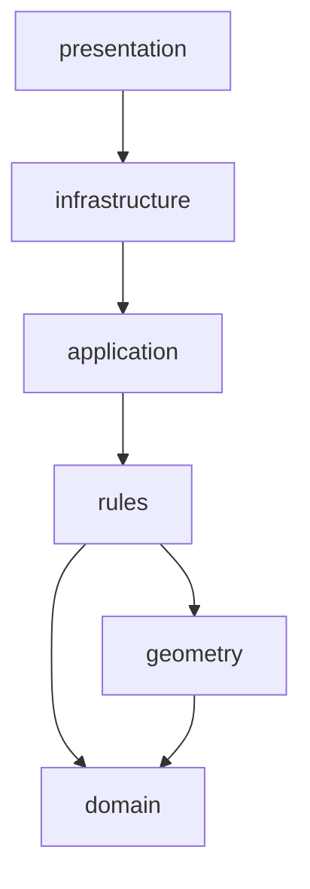

# Motor de reglas (Fase 3)

## Propósito

`cargo_optimizer.rules` responde preguntas de negocio sobre validez:
¿qué orientaciones están permitidas para este `LoadUnit`?, ¿puede
colocarse aquí?, ¿puede apilarse sobre esta otra?, ¿cuántas unidades
puede tener una caja grupal?, ¿qué advertencias o errores genera una
colocación concreta? **No decide dónde colocar nada** — eso es
responsabilidad exclusiva del futuro motor de optimización (fase 4),
que usará este motor de reglas para validar las posiciones que él
mismo proponga.

## Dependencia de `domain` y `geometry`



`rules` depende siempre de `domain`, y de `geometry` únicamente donde
una regla necesita información espacial (límites, colisión, soporte:
`spatial_rules.py`, `stacking_rules.py`, `fragility_rules.py`). Nunca
depende de `application`, `infrastructure`, `presentation` ni de
ninguna biblioteca externa. Verificado por `import-linter`. Ver
ADR-0007.

## Diferencia entre regla e invariante de dominio

Una **invariante de dominio** es una condición que un `LoadUnit` o
`LoadingSpace` nunca puede violar y se comprueba en su propio
`__post_init__` (p. ej. un extintor sin agente configurado no puede
existir). Una **regla de negocio** de este paquete es una condición
sobre cómo se *usa* o *coloca* una entidad válida, evaluable en un
contexto concreto, que puede depender de otras entidades (otras cajas
ya colocadas, el espacio de destino). El dominio nunca sabe si una
posición concreta es válida; `rules` sí.

## `RuleEvaluation`

Vocabulario común de todo el motor: `RuleSeverity` (`info`, `warning`,
`error`), `RuleViolation` (código, mensaje, severidad, referencias) y
`RuleEvaluation` (`is_allowed`, `violations`). `is_allowed` es `False`
si y solo si hay al menos una violación `error`; los `warning`/`info`
nunca rechazan. Se construye con `RuleEvaluation.allowed(...)`,
`.rejected(...)` o `.combine(...)`, nunca directamente, para que
`is_allowed` no pueda quedar inconsistente con `violations`.

## Códigos de violación

Ver `rules/codes.py` para la lista completa (`OUT_OF_BOUNDS`,
`COLLISION`, `UNSUPPORTED`, `MAX_STACK_EXCEEDED`, `FRAGILE_SUPPORT`,
`SUPPORTED_WEIGHT_EXCEEDED`, `LOADING_SPACE_WEIGHT_EXCEEDED`,
`ORIENTATION_NOT_ALLOWED`, `UNKNOWN_LOAD_UNIT_REFERENCE`, y los tres
específicos de extintores). Son constantes estables: forman parte del
contrato de la API igual que los valores de los enums de dominio (ver
ADR-0005).

## Orden de evaluación de `evaluate_candidate_placement`

1. Configuración de extintor
2. Orientación
3. Límites
4. Colisión
5. Soporte *(omitida si hay colisión)*
6. Apilamiento *(omitida si hay colisión)*
7. Fragilidad *(omitida si hay colisión)*
8. Peso soportado *(omitida si hay colisión)*
9. Peso máximo del Loading Space

No se detiene en la primera violación: acumula todas las detectables.
La única excepción es la omisión de soporte/apilamiento/fragilidad/peso
soportado cuando ya hay colisión — las cuatro dependen de "qué soporta
físicamente a la candidata", pregunta sin respuesta consistente sobre
un volumen en disputa. Ver ADR-0007, Decisión 3.

## Reglas de orientación

`allowed_orientations_for_load_unit` parte de
`load_unit.candidate_orientations()`, elimina duplicados geométricos
(cuando dos códigos distintos producen la misma caja rotada) y aplica
las reglas de extintores. `evaluate_orientation` combina esa regla con
la comprobación de que el código esté en `allowed_orientation_codes`.

## Reglas completas de extintores

**Los extintores individuales de 3 kg o más deben mantenerse
horizontales, con su eje longitudinal nominal paralelo a X.**

Cuando `is_extinguisher`, `package_type == INDIVIDUAL` y
`extinguisher_nominal_kg >= 3` (con tolerancia): solo se permiten las
orientaciones en las que la dimensión original `length_cm` termina
sobre el eje X (`OrientationCode.LWH_XYZ` y `LHW_XYZ`); cualquier otra
se rechaza, distinguiendo si `length` terminó en Z (vertical,
`EXTINGUISHER_INDIVIDUAL_MUST_BE_HORIZONTAL`) o en Y (horizontal pero
no paralelo a X, `EXTINGUISHER_AXIS_NOT_PARALLEL_TO_X`). El máximo
efectivo de apilamiento es siempre 1
(`effective_max_stack_count`), sin importar lo que declare
`max_stack_count`.

**Los extintores de 1, 2 y 3 kg en cajas grupales sí pueden colocarse
verticalmente.**

Cuando `is_extinguisher`, `package_type == GROUPED_BOX` y
`extinguisher_nominal_kg` es 1, 2 o 3 (con tolerancia): se permiten
todas las orientaciones declaradas y se respeta `max_stack_count` tal
cual lo configure el usuario. Las capacidades recomendadas (10, 8 y 6
unidades por caja respectivamente) generan una advertencia
(`EXTINGUISHER_GROUPED_CAPACITY_NONSTANDARD`) cuando `units_per_package`
difiere, nunca un rechazo.

La regla siempre usa `extinguisher_nominal_kg` (capacidad nominal del
agente extintor), nunca `weight_kg` (peso bruto del empaque) — ver
ADR-0007, Decisión 2, y `docs/DomainModel.md` para la distinción
completa entre `weight_kg`, `extinguisher_nominal_kg`,
`units_per_package`, `quantity` y `total_requested_units`.

## Apilamiento

`count_stack_level` sigue la convención: una caja en el suelo está en
nivel 1; una caja apoyada en una o más cajas está en
`1 + max(nivel de cada soporte directo)` (la convención más
restrictiva cuando el soporte proviene de niveles distintos).
`evaluate_stack_count` rechaza si ese nivel supera
`effective_max_stack_count`. No asume que una pila comparte SKU: el
nivel se calcula únicamente por geometría de soporte.

## Fragilidad

`evaluate_fragility` rechaza la candidata si se apoya, total o
parcialmente, en una `LoadUnit` con `fragile=True`, usando soporte
físico real (contacto de altura + solape horizontal positivo), no una
coincidencia aproximada de X/Y. Una `LoadUnit` frágil sí puede
colocarse sobre otra: la regla solo restringe qué se coloca *encima*
de ella.

## Soporte

`evaluate_support` delega en `cargo_optimizer.geometry.is_supported`;
por defecto exige soporte completo (`minimum_support_ratio=1.0`).
`evaluate_supported_weight` recorre **toda la cadena transitiva** de
soportes (no solo el directo): si A soporta a B y B soporta al
candidato, el límite `max_supported_weight_kg` de A también se
comprueba con el peso acumulado que ya descansa sobre A más el
candidato.

## Peso

`evaluate_loading_space_weight` suma el peso bruto (`weight_kg`) de
todas las instancias colocadas más el candidato, y rechaza si supera
`loading_space.max_weight_kg` (con una tolerancia centralizada,
`WEIGHT_TOLERANCE_KG = 1e-6`, para redondeos de coma flotante). No
calcula todavía peso por ejes ni centro de gravedad.

## Ejemplo

```python
from cargo_optimizer.rules import RulesEngine, PlacementRuleContext

engine = RulesEngine()
orientations = engine.allowed_orientations(load_unit, loading_space)
context = PlacementRuleContext(
    loading_space=loading_space,
    load_unit=load_unit,
    candidate_position=position,
    candidate_orientation=orientations[0],
    existing_placements=existing,
    load_units_by_id=load_units_by_id,
)
result = engine.evaluate_placement(context)
if not result.is_allowed:
    for violation in result.errors:
        print(violation.code, violation.message)
```

## Limitaciones actuales

- `count_stack_level` y `_weight_resting_on` no memoizan entre llamadas
  hermanas: para pilas muy profundas o muy ramificadas el coste puede
  crecer más de lo estrictamente necesario. Aceptable para los
  volúmenes de esta fase.
- `_weight_resting_on` no distribuye el peso proporcionalmente entre
  varios soportes: cada caja aporta su peso completo a cada uno de sus
  soportes directos (evaluación conservadora, nunca subestima el peso).
- No se calcula todavía distribución de peso por ejes ni centro de
  gravedad (fase de optimización o posterior).
- `RulesEngine` no tiene sistema de plugins, registro dinámico de
  reglas ni reflection: cada método delega en una función fija. Se
  añadirá solo si un caso de uso real lo requiere.

## Evolución futura

El motor de optimización (fase 4) consumirá `RulesEngine` para validar
cada posición candidata que genere, y el motor de restricciones podrá
crecer con nuevas reglas (categorías de fragilidad, reglas de
apilamiento por familia de producto) sin que `domain` ni `geometry`
cambien.
