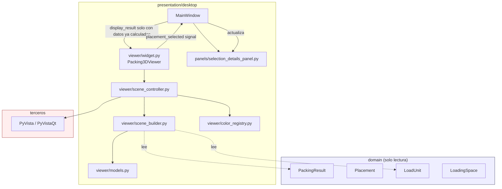
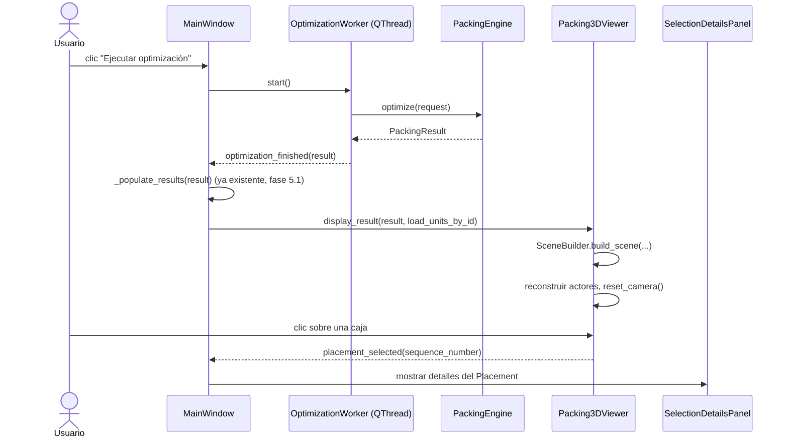

# Diseño del visor 3D (Fase 6.0)

Este documento es el diseño original de la fase 6.0. La implementación
mínima (fase 6.1) ya existe — ver `docs/ThreeDViewer.md` para el estado
real construido, incluyendo dos desviaciones deliberadas frente a este
diseño, ambas pedidas explícitamente por el encargo de la fase 6.1 (no
una reapertura de arquitectura):

- El contrato de tema del widget (sección 4, sección 17) es
  `set_dark_theme(enabled: bool)`, no `apply_theme(theme: str)`.
- `focus_placement` (sección 4) se implementó en 6.1, no se aplazó a
  6.2 como decía la sección 4 originalmente.

El resto de este documento — tecnología, arquitectura, modelo de
escena, coordenadas, colores, picking, integración con `MainWindow`,
fallback — se implementó tal cual está descrito aquí.

## Índice

1. [Objetivo del visor](#1-objetivo-del-visor)
2. [Elección tecnológica](#2-elección-tecnológica)
3. [Responsabilidad arquitectónica](#3-responsabilidad-arquitectónica)
4. [Contrato del widget principal](#4-contrato-del-widget-principal)
5. [Modelo de escena](#5-modelo-de-escena)
6. [Construcción de la escena (SceneBuilder)](#6-construcción-de-la-escena-scenebuilder)
7. [Sistema de coordenadas](#7-sistema-de-coordenadas)
8. [Representación del LoadingSpace](#8-representación-del-loadingspace)
9. [Representación de Placements](#9-representación-de-placements)
10. [Colores](#10-colores)
11. [Cámara](#11-cámara)
12. [Picking y selección](#12-picking-y-selección)
13. [Visibilidad y filtros](#13-visibilidad-y-filtros)
14. [Panel de detalles](#14-panel-de-detalles)
15. [Integración con MainWindow](#15-integración-con-mainwindow)
16. [Rendimiento y responsividad](#16-rendimiento-y-responsividad)
17. [Temas y estilo](#17-temas-y-estilo)
18. [Captura de imagen](#18-captura-de-imagen)
19. [Animación futura](#19-animación-futura)
20. [Errores y fallback](#20-errores-y-fallback)
21. [Empaquetado y distribución](#21-empaquetado-y-distribución)
22. [Testing](#22-testing)
23. [Decisiones descartadas](#23-decisiones-descartadas)
24. [Revisión crítica](#24-revisión-crítica)

---

## 1. Objetivo del visor

Un widget PySide6 que **representa** un `PackingResult` ya calculado.
API conceptual principal:

```python
viewer.display_result(result, load_units_by_id)
```

El visor no conoce ni ejecuta `PackingEngine`, `PackingRequest`,
`RulesEngine`, ningún optimizador, persistencia, importadores ni
exportadores. Es una vista de datos, no un participante en la decisión
de empaquetado — la misma separación que ya existe entre `rules`
(decide si algo es válido) y `optimization` (decide dónde colocarlo):
aquí, el visor ni decide ni valida, solo **dibuja lo que ya se
decidió**.

## 2. Elección tecnológica

### 2.1 Alternativas evaluadas

| Criterio | A. PyVista + PyVistaQt | B. VTK directo en PySide6 | C. QOpenGLWidget propio | D. VisPy |
|---|---|---|---|---|
| Integración con PySide6 | Nativa vía `pyvistaqt.QtInteractor` (soporta PySide6 a través de `qtpy`) | Nativa vía `QVTKRenderWindowInteractor`, pero de más bajo nivel | Nativa (Qt la provee), pero sin escena 3D — hay que construirla | Backend Qt disponible, menos maduro para "escena tipo CAD" |
| Soporte Windows | Wheels oficiales `win_amd64`, muy usado en apps de escritorio Windows | Igual que A (mismo VTK) | Depende del driver OpenGL del sistema, sin dependencia extra | Wheels disponibles, comunidad más pequeña en Windows |
| Mantenimiento | Muy activo, comunidad grande (ingeniería/científico) | VTK: décadas de mantenimiento (Kitware); binding Qt de VTK es más manual | Cero mantenimiento externo — todo el código es nuestro, para siempre | Activo pero con historial de ritmo irregular |
| Picking | API de alto nivel (`enable_mesh_picking`, picking por celda/punto) | Disponible pero hay que ensamblar el pipeline de picking a mano | Hay que implementarlo entero (ray-casting manual o color-picking) | Soporte básico, menos documentado que VTK |
| Cámara | `reset_camera`, `view_isometric`, `view_xy`, trackball incluido | Igual (es el mismo VTK), pero sin los atajos de alto nivel | Hay que programar órbita/zoom/pan a mano | Cámaras de escena incluidas, API distinta a VTK |
| Transparencia | Soportada (`opacity` en `add_mesh`); orden aproximado, no OIT exacto | Igual (mismo VTK) | Hay que implementar blending y ordenar manualmente | Soportada, calidad variable según backend |
| Rendimiento con miles de cajas | Bueno si se usa malla combinada o glyphs; actor-por-objeto degrada a partir de miles | Igual que A (mismo motor), sin las utilidades de alto nivel para combinar mallas | Potencialmente el más rápido si se implementa instancing a mano — coste de ingeniería alto | Bueno para nubes de puntos/instancias; menos probado para "muchas cajas orientadas con picking" |
| Exportación de imágenes | `plotter.screenshot(path)`, trivial | Posible, más código manual | Hay que leer el framebuffer a mano | Disponible, API propia |
| Facilidad de pruebas | `off_screen=True` es un modo de primera clase | Posible pero con más configuración manual | Determinista (mismo contexto Qt que el resto de la app), pero sin nada que probar hasta escribirlo todo | Tiene modo offscreen, menos documentado |
| Empaquetado del ejecutable | Wheels de VTK pesadas (~40-70 MB); hooks de PyInstaller ya existen (`pyinstaller-hooks-contrib`) | Igual peso que A, sin ninguna ventaja de tamaño | El más liviano (solo lo que ya trae Qt) | Más liviano que VTK, sin motor de mallas incluido |
| Peso de dependencias | VTK + PyVista + PyVistaQt (PyVista y PyVistaQt son ligeras; el peso real es VTK) | Solo VTK (mismo peso que A, sin las ventajas de PyVista) | Ninguna dependencia nueva | numpy + backend gráfico (menor que VTK) |
| Documentación | Extensa, con galería de ejemplos | Extensa pero de bajo nivel (hay que traducir cada ejemplo a patrones propios) | La de Qt/OpenGL en general, nada específico a nuestro caso | Razonable, bastante menor que VTK/PyVista |
| Riesgo de incompatibilidad futura | Moderado — PyVista sigue de cerca los lanzamientos de VTK; verificar compatibilidad con Python 3.12 al implementar | Igual que A (dependemos del mismo VTK) | Ninguno externo — el riesgo es 100% interno (mantenimiento propio indefinido) | Comunidad menor, menos garantía de longevidad a 10 años |

### 2.2 Análisis por opción

**B. VTK directo.** Tiene exactamente el mismo coste de dependencia y
empaquetado que la opción A, porque PyVista y PyVistaQt son capas
delgadas sobre VTK: **elegir "VTK puro" no ahorra ni una sola DLL**,
solo renuncia a las utilidades de alto nivel (picking, cámara, mallas
combinadas) que PyVista ya ofrece, obligando a reconstruirlas a mano.
No hay ninguna ventaja real. **Se descarta.**

**C. QOpenGLWidget propio.** Es la única opción con dependencias
mínimas, pero exige construir desde cero un motor de renderizado
completo: shaders, cámara, transparencia, picking, texto. Para una
aplicación comercial que debe mantenerse diez años (`CLAUDE.md`), este
es exactamente el tipo de infraestructura genérica que ya resuelve una
biblioteca madura — construirla a mano no es "no sobrearquitecturar",
es lo contrario: asumir un motor gráfico propio como pasivo de
mantenimiento permanente para un problema (cajas ortoédricas en un
espacio rectangular) que no lo justifica. **Se descarta.**

**D. VisPy.** Alternativa creíble y más liviana que VTK, con buen
rendimiento en instancing. Pero su integración con Qt, su picking y su
comunidad son sensiblemente menos maduros que los de VTK/PyVista para
el caso concreto de "escena tipo CAD con selección y cámaras
predefinidas". La ligereza no compensa la pérdida de madurez en
exactamente las dos capacidades (picking, cámara) que este visor más
necesita. **Se descarta para esta fase**, sin cerrar la puerta a
reconsiderarla si el peso de VTK resultara inaceptable en fase de
empaquetado (fase 6.1 o posterior).

### 2.3 Decisión

**Se confirma PyVista + PyVistaQt**, no por ser la recomendación
inicial sino porque, comparada con las tres alternativas, es la única
que resuelve picking, cámara y escalado de miles de mallas sin exigir
construir un motor gráfico propio. Ver ADR-0010 para el registro
formal de esta decisión, con sus riesgos aceptados explícitos
(empaquetado pesado, renderizado offscreen no garantizado en todo
entorno).

## 3. Responsabilidad arquitectónica

El visor vive en `presentation/desktop/`, nunca en `domain`,
`geometry`, `rules`, `optimization` ni `infrastructure` — es un detalle
de un mecanismo de entrega concreto (la app de escritorio), exactamente
como ya se estableció para el resto de `presentation/desktop` en las
fases 5.0/5.1 (`docs/Architecture.md`).

### 3.1 Estructura de archivos propuesta (evaluada, no la original sin más)

La estructura sugerida en el encargo tenía diez archivos en `viewer/`
más el panel. Se simplifica a seis, fusionando responsabilidades que
en 6.1 son demasiado pequeñas para justificar un archivo propio, con
un criterio explícito de cuándo separarlas:

```
presentation/desktop/
├── viewer/
│   ├── __init__.py
│   ├── widget.py            # Packing3DViewer: contrato Qt público + fallback
│   ├── scene_controller.py  # Plotter de PyVista, actores, cámara, picking, selección
│   ├── scene_builder.py     # PackingResult + load_units_by_id -> SceneModel (sin VTK/Qt)
│   ├── color_registry.py    # SKU -> QColor determinista
│   ├── models.py            # SceneModel, PlacementVisualModel (dataclasses)
│   └── constants.py         # paleta, opacidades, grosores — configuración visual centralizada
└── panels/
    └── selection_details_panel.py
```

**Fusionado dentro de `scene_controller.py` para 6.1** (no archivos
propios todavía):

- *Cámara*: para 6.1 solo hace falta encuadre automático
  (`reset_camera`) y la interacción de órbita/zoom/pan que PyVista ya
  da gratis con su estilo de interactor por defecto. Las seis vistas
  predefinidas son 6.2 (ver sección 11) — cuando existan, y en
  particular cuando la vista "desde la puerta" tenga que leer
  `door_position` y decidir entre seis casos, **ahí sí** se justifica
  extraer `camera_controller.py`.
- *Picking*: con actor-por-caja (ver sección 9), el picking es un
  diccionario `actor -> sequence_number` y una llamada a un picker de
  VTK — no justifica archivo propio todavía. Si en 6.3 se adopta malla
  combinada/glyphs, el picking pasa a resolver *cell id* o *point id*
  en vez de actor, y **ahí sí** se justifica `picking_controller.py`.
- *Visibilidad*: en 6.1 son tres booleanos (contenedor/cajas/ejes)
  sobre un puñado de actores. Los filtros por SKU/capa/modo de color
  (6.2) sí necesitan estado no trivial — **ahí sí** se justifica
  `visibility_controller.py`.

Este criterio (archivo propio solo cuando la responsabilidad ya no
cabe con claridad en `scene_controller.py`) es el que se aplicará en
6.2/6.3, no una lista cerrada de antemano.

### 3.2 Diagrama de dependencias



`viewer/` nunca importa `cargo_optimizer.optimization`: `import-linter`
ya lo permitiría (`presentation` puede importar cualquier capa
inferior), así que esta restricción es una **disciplina de diseño**,
no algo forzado hoy por herramientas — se documenta aquí y se vigila en
revisión de código, igual que `workers/optimization_worker.py` es hoy
el único módulo de `presentation/desktop` que sí importa
`optimization` (ver `CLAUDE.md`, invariantes de `presentation/desktop`).

## 4. Contrato del widget principal

```python
class Packing3DViewer(QWidget):
    placement_selected: Signal  # Signal(int | None) — sequence_number o None

    def display_result(
        self, result: PackingResult, load_units_by_id: Mapping[UUID, LoadUnit]
    ) -> None: ...
    def clear_scene(self) -> None: ...
    def reset_camera(self) -> None: ...
    def set_container_visible(self, visible: bool) -> None: ...
    def set_boxes_visible(self, visible: bool) -> None: ...
    def set_axes_visible(self, visible: bool) -> None: ...
    def set_selected_placement(self, sequence_number: int | None) -> None: ...
    def apply_theme(self, theme: str) -> None: ...
    def is_available(self) -> bool: ...
```

### 4.1 Qué entra en 6.1 y qué se aplaza

| Método | 6.1 | Motivo |
|---|---|---|
| `display_result` | **Sí** | Razón de ser del widget. |
| `clear_scene` | **Sí** | Necesario antes de una nueva optimización o proyecto nuevo. |
| `reset_camera` | **Sí** | Encuadre automático — sin él, el resto no es utilizable. |
| `set_container_visible` | **Sí** | Trivial una vez existe el actor del contenedor; forma parte de la lista mínima del encargo (sección 14). |
| `set_boxes_visible` | **Sí** | Igual que el anterior. |
| `set_axes_visible` | **Sí** | Igual que el anterior. |
| `set_selected_placement` | **Sí** | "Selección" es explícitamente parte del mínimo de 6.1. |
| `apply_theme` | **Sí** (no estaba en la lista original, se añade) | Sin esto, el visor no se integra con el tema claro/oscuro ya existente (`style.py`) — se detecta como hueco real durante el diseño, ver sección 17. |
| `is_available` | **Sí** (no estaba en la lista original, se añade) | Necesario para que `MainWindow` pueda decidir si mostrar controles relacionados (p. ej. atenuar "Vista 3D" en el toolbar) sin acoplarse a excepciones — ver sección 20. |
| `set_labels_visible` | Aplazado a 6.2 | Las etiquetas están explícitamente aplazadas (sección 13 del encargo). |
| `focus_placement` | Aplazado a 6.2 | Es "cámara a medida sobre una caja"; las vistas más allá del encuadre general son 6.2 (sección 24 del encargo lo confirma: "vistas predefinidas" es 6.2). |
| `capture_image` | Aplazado a 6.2 | El propio encargo lo permite aplazar a exportaciones (sección 19). |

`placement_selected` es la única señal Qt del widget en 6.1: se emite
al hacer clic sobre una caja (nunca al llamar `set_selected_placement`
programáticamente — ver sección 12.3, prevención de ciclos).

## 5. Modelo de escena

Dataclasses propias de `presentation`, nunca se usan como sustituto de
`Placement`/`LoadUnit`, y `Placement`/`LoadUnit`/`PackingResult` no se
tocan para guardar aquí estado visual.

```python
@dataclass(frozen=True, slots=True)
class PlacementVisualModel:
    sequence_number: int
    load_unit_id: UUID
    sku: str                      # "?" si el LoadUnit no se encontró — nunca lanza
    name: str
    position_cm: tuple[float, float, float]
    dimensions_cm: tuple[float, float, float]   # ya orientadas (x_size/y_size/z_size)
    orientation_code: str
    weight_kg: float
    color: str                    # "#RRGGBB", resuelto por ColorRegistry
    fragile: bool
    is_extinguisher: bool
    package_type: str
    units_per_package: int
    max_stack_count: int
    notes: str
    visible: bool = True
    selected: bool = False


@dataclass(frozen=True, slots=True)
class SceneModel:
    loading_space_name: str
    loading_space_category: str
    loading_space_dimensions_cm: tuple[float, float, float]
    door_position: str
    placements: tuple[PlacementVisualModel, ...]
    bounds_cm: tuple[float, float, float, float, float, float]  # xmin,xmax,ymin,ymax,zmin,zmax
    selected_sequence_number: int | None = None
```

`SceneModel` **no** incluye todavía `visible_sku`/`visible_layers`
como conjuntos de estado propio: para 6.1, visibilidad es un booleano
por caja (`PlacementVisualModel.visible`), suficiente para
contenedor/cajas/ejes. El "estado de visibilidad" más rico que pide el
encargo (SKU visibles, capas visibles, modo de color) es exactamente
lo que la sección 13 del encargo aplaza a 6.2 — se reserva el campo
`display_mode: str = "sku"` en `SceneModel` desde ya (con un único
valor posible en 6.1) para no tener que romper el dataclass cuando
lleguen los demás modos.

```python
@dataclass(frozen=True, slots=True)
class SceneModel:
    ...
    display_mode: str = "sku"  # único valor válido en 6.1; "weight"/"order"/"fragility" llegan en 6.2
```

Ambas clases son inmutables (mismo estilo que `domain`, ADR-0005, por
consistencia de código aunque no sea una regla que aplique fuera de
`domain`): reconstruir un `SceneModel` nuevo en cada `display_result`
es más simple de razonar que mutar uno existente, y el coste de
reconstruirlo es insignificante comparado con reconstruir los actores
de PyVista.

## 6. Construcción de la escena (SceneBuilder)

```python
def build_scene(
    result: PackingResult, load_units_by_id: Mapping[UUID, LoadUnit]
) -> SceneModel: ...
```

Responsabilidades: interpretar `LoadingSpace`, transformar cada
`Placement` en un `PlacementVisualModel`, resolver SKU/nombre/color vía
`load_units_by_id` + `ColorRegistry`, calcular `bounds_cm`. **No**
decide dónde colocar nada (eso ya está decidido: viene en `result`), no
importa `optimization`, no importa PyVista/Qt — es una función pura,
totalmente probable sin GPU ni `QApplication`.

### 6.1 El problema real: `Placement` solo tiene `load_unit_id`

`PackingResult.placements` son `Placement` (`load_unit_id`,
`instance_number`, `position`, `orientation`, `sequence_number`).
`PackingResult.loading_space` sí es un `LoadingSpace` completo. Pero
SKU, nombre, peso, color, fragilidad y notas viven en `LoadUnit`, al
que `Placement` no referencia directamente — exactamente el mismo
problema que `UnpackedUnit` ya planteaba en la fase 5.1 y que ya se
resolvió allí.

**Alternativas evaluadas:**

- **A. Entregar también un mapping `UUID -> LoadUnit`.** Es
  literalmente el patrón que `UnpackedUnitTableModel.set_unpacked_units`
  ya usa desde la fase 5.1 (`presentation/desktop/models/unpacked_table_model.py`),
  y el propio `MainWindow` ya construye y conserva
  `self._last_load_units_by_id` para ese fin exacto. No añade ningún
  tipo nuevo, no toca dominio, no depende de nada que hoy no exista en
  el flujo de `MainWindow`.
- **B. Crear un DTO visual en `application`/`presentation`.**
  Redundante con la opción A si el DTO solo va a llevar los mismos
  campos de `LoadUnit` — sería una copia paralela del esquema de
  dominio que hay que mantener sincronizada a mano, justo lo que
  `docs/Architecture.md` ya advierte evitar. Se usaría únicamente si el
  visor necesitara datos que **no** existen en `LoadUnit` (no es el
  caso).
- **C. Ampliar `PackingResult`.** Modifica `domain`, prohibido en esta
  fase salvo bug objetivo (no lo es), y conceptualmente incorrecto:
  `PackingResult` no debería cargar con las `LoadUnit` completas de
  cada colocación — ya es una decisión de diseño de fase 2.1 que
  `Placement` referencia por `id`, no por valor, precisamente para no
  duplicar los datos de un `LoadUnit` en cada colocación.
- **D. Construir desde `CargoProject` + `PackingResult`.**
  `CargoProject` agrupa `LoadingSpace` + `LoadUnit`\ + `latest_result`,
  pero **no está en uso todavía**: `MainWindow` no construye ni
  persiste ningún `CargoProject` hoy (eso es fase 7). Exigir un
  `CargoProject` como entrada obligatoria del visor introduciría una
  dependencia a un agregado que el resto de la interfaz ni siquiera usa
  todavía, solo para resolver un problema que la opción A ya resuelve
  con datos que `MainWindow` ya tiene en la mano.

**Recomendación: opción A.** Mismo patrón que `UnpackedUnitTableModel`,
cero piezas nuevas de dominio, cero acoplamiento a `CargoProject` antes
de que exista en el flujo real. `display_result(result,
load_units_by_id)` es la firma resultante (ver sección 4).

### 6.2 Caso de referencia desconocida

Si `Placement.load_unit_id` no está en `load_units_by_id` (dato
corrupto o inconsistente — no debería ocurrir con datos que vienen del
propio `PackingEngine`, pero el visor no debe asumirlo), `SceneBuilder`
no lanza excepción: usa `sku="?"`, `name="Desconocido"`, y un color de
`ColorRegistry` derivado del propio `load_unit_id` (sección 20).

## 7. Sistema de coordenadas

Se respeta sin excepción la convención ya documentada
(`docs/DomainModel.md`): X = largo, Y = ancho, Z = altura; origen en el
suelo, esquina trasera izquierda; X crece hacia la puerta; Y de
izquierda a derecha; Z hacia arriba.

**Regla explícita: la geometría que construye `SceneBuilder`/
`scene_controller` nunca permuta ejes.** Un punto `(x_cm, y_cm, z_cm)`
del dominio se dibuja en PyVista como el punto `(x, y, z)`, sin
reordenar componentes. VTK es agnóstico de qué eje es "arriba": por
defecto, muchas vistas de cámara de VTK asumen Y-arriba en su
`view_isometric()`, así que **"Z arriba" se consigue fijando el
parámetro de cámara `view_up = (0, 0, 1)`, no reordenando datos** — es
una transformación de vista, no de datos, y queda documentada
explícitamente aquí y en el código (`scene_controller.py`) el día que
se implemente, tal como exige el encargo.

## 8. Representación del LoadingSpace

- **Suelo**: plano rectangular en `z=0`, semitransparente u opaco según
  tema (sección 17), del tamaño `length_cm × width_cm`.
- **Paredes**: cuatro planos semitransparentes en los límites
  `x∈{0,length}` / `y∈{0,width}`, hasta `height_cm`. Semitransparentes
  para no ocultar las cajas — la transparencia real de VTK no resuelve
  el ordenamiento perfecto de superficies transparentes solapadas, pero
  para paredes simples (sin solaparse entre sí) es suficiente sin
  necesitar *order-independent transparency*.
- **Estructura de alambre**: las 12 aristas del prisma como líneas,
  siempre visibles incluso si suelo/paredes se ocultan — es el
  "esqueleto" mínimo de referencia.
- **Puerta destacada**: un resaltado (color de acento o borde grueso)
  en la cara correspondiente a `LoadingSpace.door_position`
  (`FRONT`/`REAR`/`LEFT`/`RIGHT`/`TOP`); `UNRESTRICTED` no resalta
  ninguna cara (no hay una puerta única que destacar).
- **Etiqueta de dimensiones**: texto con `length × width × height cm`
  cerca de una arista — aplazado a 6.2 junto con el resto de etiquetas
  (sección 13 del encargo).
- **Categoría** (`LoadingSpaceCategory`): la geometría base es siempre
  el mismo prisma rectangular — la categoría **nunca** cambia
  `PackingResult` ni la geometría, solo detalles puramente visuales
  (p. ej. un tono de pared ligeramente distinto para `WAREHOUSE` frente
  a `CONTAINER`, si en 6.1/6.2 se decide que aporta claridad). No es un
  requisito de 6.1: se deja como posible detalle de pulido en 6.2, no
  estructural.

## 9. Representación de Placements

Cada `Placement` → un paralelepípedo sólido a escala, con:

- relleno de color por SKU (sección 10);
- borde fino (mejora la lectura de límites entre cajas adyacentes del
  mismo color);
- resaltado de selección (contorno/emisión distinta, sin cambiar el
  color de relleno — para no perder la referencia de SKU al
  seleccionar, ver sección 10.2);
- identificación estable por `sequence_number` (nunca por índice de
  lista, que cambiaría si la lista se reordena).

### 9.1 Estrategia de renderizado por volumen de cajas

| Cantidad | Actor por caja | MultiBlock | Glyphs/instancing | Agrupación por SKU |
|---:|---|---|---|---|
| ≤ 500 | Sin problema, picking y visibilidad triviales | Sin ventaja clara a este tamaño | Complejidad innecesaria | Sin ventaja clara |
| 1.000 | Aceptable en hardware normal; empieza a notarse el tiempo de construcción | Reduce actores, mismo picking indirecto | Empieza a justificarse | Reduce actores si hay pocos SKU distintos |
| 5.000 | Previsiblemente lento (construcción y framerate) — **no medido** | Razonable | Recomendable | Razonable si hay pocos SKU |
| 10.000 | Previsiblemente impráctico — **no medido** | Necesario revisar picking (pasa a resolver celda, no actor) | La opción más escalable | Insuficiente por sí sola a este tamaño |

Estos números son una **expectativa razonada a partir del
comportamiento conocido y documentado públicamente de VTK** (el coste
por actor es de proceso, no de GPU, y se vuelve el cuello de botella
mucho antes que el límite de la tarjeta gráfica), **no una medición
propia** — no prometerlos como garantía (sección 16 del encargo lo
exige explícitamente).

**Recomendación para 6.1: actor por caja.** Motivo, no solo comodidad:

1. Picking trivial y exacto: el picker de VTK devuelve el actor
   pulsado, y un diccionario `actor -> sequence_number` resuelve la
   selección sin ninguna tabla de celdas.
2. Visibilidad/resaltado por caja triviales: `actor.SetVisibility(...)`
   /cambiar su color, sin reconstruir ninguna malla.
3. El propio motor de optimización, hoy, no produce escenarios de
   miles de cajas en tiempo práctico: `docs/OptimizerPerformance.md`
   documenta ~80 s para 100 instancias y ni siquiera alcanza el
   objetivo de 250 "prácticas" — **el visor no necesita resolver hoy
   una escala que el resto del sistema todavía no puede producir**.

El modelo de escena (`SceneModel`/`PlacementVisualModel`, sección 5) es
deliberadamente agnóstico de la estrategia de renderizado: es una lista
de descriptores, no una lista de actores VTK. Cambiar de actor-por-caja
a malla combinada/glyphs en 6.3 es un cambio confinado a
`scene_controller.py`, no un rediseño del contrato del widget ni del
modelo de escena.

## 10. Colores

### 10.1 Fuente y política

1. Color primario: `LoadUnit.color_hex` — el dominio ya lo valida
   (`^#[0-9A-Fa-f]{6}$`) y siempre tiene un valor por defecto
   (`"#CCCCCC"`), así que en la práctica **siempre** hay un color
   válido cuando el `LoadUnit` se encuentra en `load_units_by_id`.
2. Si el `Placement` referencia un `load_unit_id` desconocido (sección
   6.2), no hay `LoadUnit` del que leer `color_hex`: `ColorRegistry`
   asigna un color determinista derivado del propio `load_unit_id`.
3. `ColorRegistry` también es la base para los modos de color por
   peso/orden/fragilidad de 6.2 (una paleta o gradiente, no solo el
   hex literal).

### 10.2 Determinismo real, no solo "no aleatorio"

"Mismo SKU → mismo color entre ejecuciones" **no** se cumple usando
`hash(str)` de Python: desde Python 3.3, el hash de cadenas está
aleatorizado por proceso (`PYTHONHASHSEED`) por seguridad — dos
ejecuciones del programa producirían colores de repuesto distintos para
el mismo SKU aunque el código nunca use `random`. `ColorRegistry` debe
usar un hash estable entre procesos (p. ej. `zlib.crc32` o
`hashlib.md5` sobre los bytes UTF-8 del SKU/UUID), indexado sobre una
paleta curada de ~20-30 colores de alto contraste — nunca RGB aleatorio
directo del hash, que produce colores apagados/de bajo contraste con
facilidad.

Selección: se distingue con un resalte de borde/contorno (color de
acento consistente con `style.py::_ACCENT`), no cambiando el relleno —
cambiar el relleno perdería la asociación visual "este color = este
SKU" precisamente cuando el usuario más la necesita (acaba de
seleccionar la caja para inspeccionarla).

Modo oscuro/claro: la paleta de cajas no cambia con el tema (los
colores de producto son datos, no parte del tema), pero sí cambian
fondo, paredes, ejes y color de selección — ver sección 17.

## 11. Cámara

- Órbita, zoom y pan: el estilo de interactor por defecto de VTK
  (`vtkInteractorStyleTrackballCamera`, el que usa `pyvistaqt` por
  defecto) ya los da sin código propio — reutilizar, no reimplementar.
- `reset_camera` (encuadre automático de todo lo visible): usa el
  cálculo de límites de PyVista sobre los actores actuales, así que se
  adapta automáticamente a espacios pequeños o grandes sin ninguna
  distancia fija — cumple la exigencia explícita del encargo de no usar
  medidas fijas.
- Vistas predefinidas (isométrica, superior, frontal, lateral
  izquierda/derecha, desde la puerta): diseñadas aquí, **implementadas
  en 6.2** (confirmado por la propia sección 24 del encargo). La vista
  "desde la puerta" es la más particular: debe leer
  `loading_space.door_position` y elegir el punto de cámara
  correspondiente; `UNRESTRICTED` (sin puerta única) recae en la vista
  isométrica por defecto.

## 12. Picking y selección

### 12.1 Datos mostrados al seleccionar

SKU, nombre, número de instancia, número de secuencia, posición X/Y/Z,
dimensiones orientadas, código de orientación, peso bruto, unidades por
paquete, tipo de empaque, extintor, peso nominal, fragilidad,
apilamiento máximo, notas — todos ya presentes en
`PlacementVisualModel` + el `LoadUnit` resuelto (sección 5), ninguno
requiere dato nuevo.

### 12.2 Selección visual, tabla futura, y sincronización

- Clic en una caja → `scene_controller` resuelve `actor ->
  sequence_number` → resalta la caja → `Packing3DViewer` emite
  `placement_selected(sequence_number)`.
- Clic en vacío → deselecciona → `placement_selected(None)`.
- Selección **desde tabla** (una futura tabla de placements cargados,
  no existente todavía): llamaría a
  `viewer.set_selected_placement(sequence_number)` — el mismo método
  que ya expone el contrato de 6.1, sin necesitar una tabla nueva para
  que el método exista y sea útil hoy (p. ej. desde
  `SelectionDetailsPanel` o pruebas).

### 12.3 Prevención de ciclos de señales

Patrón estándar de sincronización Qt (el mismo problema que
sincronizar un slider y un spin box): `set_selected_placement`,
cuando se llama **desde fuera** (p. ej. desde una futura tabla), no
debe volver a emitir `placement_selected` — si lo hiciera, y el
llamador externo estuviera a su vez escuchando esa señal para
actualizar su propia selección, se entraría en un ciclo. Diseño:
`set_selected_placement` actualiza el estado visual sin emitir la
señal; la señal se emite **únicamente** desde el manejador interno del
evento de clic de picking. Es decir, la señal representa "el usuario
seleccionó algo en el visor", no "la selección cambió por cualquier
motivo".

## 13. Visibilidad y filtros

Para 6.1, exactamente lo que la sección 14 del encargo fija como
mínimo: mostrar/ocultar LoadingSpace, mostrar/ocultar cajas,
mostrar/ocultar ejes, selección, color por SKU.

**Aplazado a 6.2** (documentado, no implementado): filtrar por SKU,
filtrar por capa (rango de Z), ocultar placements seleccionados,
mostrar solo cajas no cargadas (tiene sentido distinto: los
`UnpackedUnit` no tienen `Placement` — no hay posición que dibujar; si
se implementa, sería una representación aparte, p. ej. apiladas fuera
del contenedor, no "las mismas cajas ocultas"), colorear por
peso/orden de carga/fragilidad/tipo de empaque, etiquetas.

## 14. Panel de detalles

`SelectionDetailsPanel` (nuevo, en `presentation/desktop/panels/`,
mismo patrón que `ResultsPanel`/`WarningsPanel` de la fase 5.1): un
formulario de solo lectura con los campos de la sección 12.1.

Se actualiza cuando:

- se selecciona una caja en 3D (`Packing3DViewer.placement_selected`);
- se selecciona un Placement desde una tabla futura (mismo camino,
  sección 12.2);
- se limpia la selección (`placement_selected(None)` → panel vacío,
  mismo patrón `_EMPTY = "—"` que `ResultsPanel`);
- se ejecuta una nueva optimización (`MainWindow` limpia el panel al
  iniciar, igual que ya limpia `results_panel`/`unpacked_table_panel`/
  `warnings_panel` en `_on_run_optimization`).

No modifica dominio; solo lee y muestra.

## 15. Integración con MainWindow



El renderizado ocurre en el **hilo de GUI** — no hay alternativa
razonable: los objetos VTK/Qt de una escena solo pueden tocarse desde
el hilo que los creó, igual que cualquier widget Qt. `PackingEngine`
sigue exclusivamente en `OptimizationWorker` (invariante ya establecida
en la fase 5.1, sin cambios). El coste de *construir* la escena si
importa (sección 16): la mitigación no es moverlo de hilo, es hacerlo
rápido o troceado.

### 15.1 Sustitución del placeholder sin romper nada existente

`viewport_3d_placeholder` hoy es un `QWidget` cualquiera añadido a
`work_area_splitter` (`main_window.py::_build_central_layout`); el
resto del código (`_on_toggle_3d_focus`, `_on_reset_layout`,
`_restore_ui_state`) lo trata genéricamente por posición en el
splitter, no por tipo concreto — sustituirlo por `Packing3DViewer` es,
estructuralmente, cambiar una línea
(`self.viewport_3d_placeholder = Viewport3DPlaceholder(self)` →
`Packing3DViewer(self)`) más la llamada a `display_result` en
`_on_optimization_finished`. No afecta: la optimización en `QThread`
(sigue igual), la barra de progreso, la cancelación, los paneles
existentes, `QSettings` (el visor no necesita persistir nada nuevo en
6.1 — la cámara no se guarda entre sesiones todavía), el tema
claro/oscuro (sección 17), ni la convención de tests offscreen (sección
22, con matices propios del renderizado 3D).

## 16. Rendimiento y responsividad

Estrategias diseñadas para cuando el volumen de cajas lo justifique:

- construir la escena por pasos (procesar N placements por iteración
  del bucle de eventos) si `display_result` se nota lento a partir de
  cierto tamaño;
- indicador de carga (reutilizar el patrón ya existente de
  `_progress_bar` de `MainWindow`, o un indicador propio del visor)
  durante la construcción;
- agrupar cajas (sección 9.1) si el actor-por-caja deja de ser
  razonable;
- no reconstruir la escena completa al seleccionar: `set_selected_placement`
  solo cambia la propiedad visual de dos actores (el que pierde
  selección, el que la gana), nunca reconstruye `SceneModel` ni vuelve
  a crear actores;
- liberar explícitamente los actores anteriores en `clear_scene`/antes
  de reconstruir en `display_result` (VTK no libera memoria de GPU
  automáticamente solo por perder la referencia Python si el actor
  sigue registrado en el renderer — hay que quitarlo del renderer
  explícitamente);
- destruir correctamente el `QtInteractor`/`Plotter` al cerrar la
  ventana (`closeEvent`, mismo punto donde `MainWindow` ya cancela un
  worker en curso, fase 5.1) — PyVista expone `plotter.close()` para
  esto.

Objetivos razonables para 6.1 (deseables, **no medidos todavía** — se
medirán con datos reales al implementar, mismo criterio que
`docs/PerformanceBaseline.md`):

| Cajas | Objetivo deseable |
|---:|---|
| 100 | Construcción de escena imperceptible (\<0.5 s) |
| 500 | Construcción de escena rápida (\<2 s), interacción fluida |
| 1.000 | Construcción tolerable (unos segundos), interacción todavía usable |
| 5.000 | Fuera de alcance razonable para actor-por-caja en 6.1 — requiere la agrupación de la sección 9.1, prevista para 6.3 |

## 17. Temas y estilo

Centralizado en `viewer/constants.py` (nunca colores sueltos en medio
de la lógica de escena), en el mismo espíritu que `style.py` ya separa
paleta de lógica:

| Elemento | Tema claro | Tema oscuro |
|---|---|---|
| Fondo del visor | Gris muy claro, coherente con `_light_palette().Window` | Gris muy oscuro, coherente con `_dark_palette().Window` |
| Paredes/suelo | Gris neutro semitransparente | Gris neutro semitransparente, más oscuro |
| Ejes | Colores estándar X/Y/Z de alto contraste sobre el fondo elegido | Igual, ajustados para contraste sobre fondo oscuro |
| Selección | `_ACCENT` (`#3D6E8C`, ya definido en `style.py`) — reutilizar, no inventar un segundo azul | Igual |
| Texto/etiquetas | Igual que `QPalette.WindowText` del tema activo | Igual |

`Packing3DViewer.apply_theme(theme)` se llama desde
`MainWindow._set_theme` (punto ya existente desde la fase 5.0), igual
que hoy se llama `apply_theme(app, theme)` sobre la aplicación entera.

## 18. Captura de imagen

Diseño sin implementar (sección 19 del encargo lo permite aplazar a
exportaciones):

- `capture_image(path, *, resolution=None, transparent_background=False)`;
- encuadre actual por defecto; una vista isométrica automática como
  variante explícita para reportes;
- uso futuro: incrustar la imagen capturada en un PDF (fase 8) — el
  contrato ya anticipa esto sin comprometerse a implementarlo ahora.

`PyVista.Plotter.screenshot(path)` ya resuelve esto casi
completamente cuando se implemente; no se prevé necesidad de código
propio de captura.

## 19. Animación futura

Diseño para no bloquear la puerta, sin implementar en 6.1:

- animación por `sequence_number` (reproducir las cajas en el orden en
  que el motor las colocó) — el propio `sequence_number` ya es, por
  diseño, un orden estable y determinista (`docs/OptimizationEngine.md`),
  así que no hace falta ningún dato nuevo para animarlo;
- controles: reproducir, pausar, avanzar, retroceder, velocidad;
- "mostrar las primeras N cajas" es el mismo mecanismo que
  `PlacementVisualModel.visible` ya expone (sección 5) — ocultar todo
  placement con `sequence_number > N`, sin necesitar un modelo de
  datos distinto;
- simular carga/descarga: reproducir la animación hacia adelante o
  hacia atrás.

Decisión de diseño actual que **no** bloquea esto: `SceneModel` guarda
una lista completa de `PlacementVisualModel` con `visible` por caja
desde el principio, en vez de construir la escena ya "recortada" — la
animación de 6.3 solo necesita ir cambiando qué subconjunto está
visible, sin tocar `SceneBuilder` ni reconstruir la escena.

## 20. Errores y fallback

| Fallo | Comportamiento |
|---|---|
| PyVista/PyVistaQt no instalados | `Packing3DViewer` captura el `ImportError` en construcción, `is_available()` devuelve `False`, se muestra el contenido de fallback (variante del placeholder actual, con mensaje específico) |
| `QtInteractor` falla al inicializar (VTK/OpenGL) | Se captura la excepción de inicialización, mismo fallback que el caso anterior |
| OpenGL no disponible / driver falla | Mismo fallback — no hay forma de distinguir de antemano sin intentarlo, así que el manejo es el mismo camino de código |
| `PackingResult` vacío (`placements == ()`) | `display_result` dibuja el `LoadingSpace` vacío igualmente — no es un error, es un resultado legítimo (0 cajas) |
| `Placement` referencia `LoadUnit` desconocida | `SceneBuilder` no lanza, usa valores de repuesto (sección 6.2) |
| Color inválido | No debería ocurrir (`LoadUnit.color_hex` ya está validado por dominio); si ocurriera igualmente (dato legado, defensivo), `ColorRegistry` cae al color determinista de repuesto en vez de propagar la excepción de construcción de color de PyVista/Qt |
| Geometría inválida (dimensión ≤ 0) | No debería ocurrir (`Dimensions3D` ya lo prohíbe en dominio); defensivamente, `SceneBuilder` omite ese placement del `SceneModel` en vez de fallar toda la escena, y lo registra como aviso — más adelante, con el mecanismo de log de la fase 5.1 (`LogPanel`) |

**Principio rector: la aplicación debe poder abrirse y usarse (incluida
la optimización completa y los resultados numéricos) aunque el visor
3D no funcione en absoluto.** Todos los métodos públicos de
`Packing3DViewer` son no-op seguros cuando `is_available()` es `False`
— `MainWindow` **nunca** necesita comprobar `is_available()` antes de
llamar a `display_result`; el propio widget decide internamente si hay
algo que dibujar. Esto es simétrico con cómo `MainWindow` ya trata los
errores del motor (fase 5.1): capturar en el punto más bajo posible,
nunca dejar que una excepción de un subsistema tire la ventana entera.

## 21. Empaquetado y distribución

Riesgos identificados para cuando llegue el empaquetado (fuera de
alcance de esta fase, documentado para no sorprender más adelante):

- **Tamaño**: las wheels de VTK son sustancialmente más pesadas
  (decenas de MB) que el resto de dependencias actuales del proyecto
  (`PySide6` ya es la dependencia más pesada hoy; VTK se sumaría, no la
  sustituiría).
- **PyInstaller**: existen hooks mantenidos por la comunidad
  (`pyinstaller-hooks-contrib` incluye reglas para VTK/PyVista), pero
  hay que verificarlos contra la versión exacta de VTK/PyVista elegida
  al implementar — no asumir que "simplemente funciona" sin probarlo.
- **Nuitka**: menos terreno probado que PyInstaller para VTK
  específicamente — se recomienda validar con un empaquetado de prueba
  antes de comprometerse a Nuitka como única vía si se evalúa en el
  futuro.
- **DLL y plugins Qt**: VTK no trae su propio Qt — usa el binding que
  ya tenga la app (`pyvistaqt.QtInteractor` se apoya en el PySide6 ya
  presente), así que no hay dos runtimes de Qt compitiendo. El riesgo
  real es de *orden de carga* de DLL nativas (VTK + drivers OpenGL del
  sistema) en el instalador final — a verificar empíricamente, no
  asumible de antemano.
- **Compatibilidad de drivers OpenGL**: en máquinas cliente con drivers
  gráficos antiguos o entornos virtualizados sin aceleración 3D, el
  visor podría fallar a inicializar — exactamente el escenario que la
  sección 20 (fallback) existe para cubrir, así que el empaquetado no
  necesita resolverlo por sí mismo, solo el fallback ya diseñado.

No se empaqueta nada en esta fase; esta sección es un mapa de riesgos
para cuando llegue la fase de distribución (fuera del roadmap actual,
después de la fase 10 o como parte de ella).

## 22. Testing

### 22.1 Qué se puede probar sin GPU

- **Unitarias, sin Qt ni VTK**: `SceneBuilder` (transforma
  `PackingResult`+`load_units_by_id` en `SceneModel` — función pura),
  `ColorRegistry` (determinismo entre llamadas y entre "procesos"
  simulando limpiar cualquier estado de módulo), los propios dataclasses
  del modelo visual, y la lógica de resolución de referencias
  desconocidas (sección 6.2) — estas se ejecutan en cualquier entorno,
  igual que el resto de la suite hoy.
- **Con Qt `offscreen`, sin garantía de OpenGL real**: creación del
  `QWidget` contenedor, comportamiento de `is_available()` cuando se
  simula (vía monkeypatch) que PyVista no está disponible, señales
  (`placement_selected` con mocks en vez de un picking real), destrucción
  limpia del widget.
- **Con Qt `offscreen` + OpenGL real (condicional)**: `display_result`
  con una escena real, `clear_scene`, cambio de tema — requieren que
  VTK consiga crear un contexto OpenGL incluso sin ventana visible, lo
  cual **no está garantizado en todo entorno** (una máquina de
  desarrollo con GPU/drivers normales sí lo consigue; un entorno CI
  totalmemente headless sin ningún driver puede no conseguirlo). Estas
  pruebas deben poder saltarse (`pytest.skip`) limpiamente si la
  inicialización de PyVista falla, usando el mismo mecanismo de
  detección que el fallback de producción (`is_available()`) — nunca
  fallar la suite completa por falta de GPU en el entorno de ejecución.

### 22.2 Plan de pruebas por capa

- **Unitarias**: `SceneBuilder`, `ColorRegistry`, modelos visuales,
  transformación de orientación → dimensiones, resolución de selección
  (`actor -> sequence_number` con actores simulados, no VTK real).
- **Qt offscreen**: creación del widget, `display_result` con resultado
  vacío, `display_result` con placements (condicional a
  `is_available()`), `clear_scene`, señales, cambio de tema,
  destrucción limpia (sin fugas de recursos detectables, p. ej. sin
  excepción al cerrar dos veces).
- **Integración**: `MainWindow` recibe `PackingResult` → lo entrega al
  visor → selección actualiza `SelectionDetailsPanel` → una nueva
  optimización reemplaza la escena anterior (mismo patrón que las
  pruebas de integración de `MainWindow` ya existentes en
  `tests/presentation/desktop/test_main_window_optimization.py`).
- **Visuales** (captura de imágenes de referencia): diseñadas pero
  **no obligatorias en todo equipo** — dependen de un contexto OpenGL
  real y de una tolerancia de comparación de píxeles razonable (fuentes,
  antialiasing y drivers varían entre máquinas); se marcan como un
  grupo de pruebas opcional/manual, no parte de la suite obligatoria
  (`pytest -m ...` o directorio separado, a decidir en 6.1), para no
  romper la ejecución en máquinas sin GPU dedicada.

## 23. Decisiones descartadas

- **VTK directo sin PyVista** (sección 2.2): mismo coste de
  dependencias, sin ninguna ventaja — descartado.
- **QOpenGLWidget propio** (sección 2.2): coste de ingeniería
  desproporcionado para el problema real — descartado.
- **VisPy** (sección 2.2): ligereza real, pero picking/cámara/Qt menos
  maduros para este caso concreto — descartado para esta fase.
- **DTO visual paralelo a `LoadUnit`** (sección 6.1, opción B):
  redundante mientras el DTO solo replicaría campos ya existentes —
  descartado en favor de reutilizar `LoadUnit` real vía mapping.
- **Ampliar `PackingResult` con datos de `LoadUnit`** (sección 6.1,
  opción C): modifica dominio sin necesidad real — descartado.
- **Construir la escena desde `CargoProject`** (sección 6.1, opción D):
  acopla el visor a un agregado que el resto de la interfaz no usa
  todavía — descartado para 6.1 (reevaluable en fase 7, cuando
  `CargoProject` sí forme parte del flujo real).
- **Malla combinada / glyphs desde el principio** (sección 9.1):
  resuelve una escala que el propio motor de optimización no produce
  todavía en tiempo práctico — descartado para 6.1, no descartado para
  siempre (6.3).
- **Cambiar el color de relleno al seleccionar** (sección 10.2): pierde
  la referencia visual de SKU justo cuando más se necesita — descartado
  en favor de un resalte de borde/contorno.
- **Estructura de 10 archivos en `viewer/`** (sección 3.1): tres de
  ellos (`camera_controller.py`, `picking_controller.py`,
  `visibility_controller.py`) no tienen responsabilidad suficiente en
  6.1 para justificar un archivo propio — fusionados en
  `scene_controller.py` con un criterio explícito de cuándo separarlos.

## 24. Revisión crítica

**1. ¿PyVista + PyVistaQt sigue siendo la mejor opción?**
Sí, pero no es una opción sin costes: es la mejor opción *disponible*
dado el contexto (Windows, PySide6, equipo pequeño, necesidad real de
picking y cámara maduros), no una elección gratuita. El coste real es
de empaquetado (VTK es pesado) y de garantía de renderizado headless en
entornos sin GPU — ambos aceptados explícitamente en ADR-0010, no
ignorados.

**2. ¿Qué riesgo técnico es el más importante?**
El empaquetado (tamaño del instalador y compatibilidad de drivers
OpenGL en el parque de máquinas del cliente final), no el riesgo de
implementación — picking, cámara y mallas están bien documentados y
resueltos por PyVista. El riesgo de empaquetado es el que menos
control tenemos sobre él (depende de máquinas que no controlamos) y el
que menos se puede mitigar solo con buen diseño de código.

**3. ¿Qué funciones deben entrar obligatoriamente en 6.1?**
`LoadingSpace` renderizado, cajas renderizadas (actor por caja), cámara
con encuadre automático, color por SKU, selección (clic + señal +
`set_selected_placement`), panel de detalles, fallback si el 3D no
arranca, integración con `MainWindow` sin bloquear el hilo de GUI en la
construcción de la escena.

**4. ¿Qué funciones deben aplazarse?**
Etiquetas, vistas de cámara predefinidas (más allá del encuadre
automático), captura de imagen, filtros (SKU/capa/no-cargados), modos
de color alternativos, animación, cortes/explosión, y cualquier
estrategia de renderizado más allá de actor-por-caja.

**5. ¿Actor por caja o agrupación?**
Actor por caja para 6.1. No es la opción "más simple porque sí": es la
más simple que sigue siendo razonable dado que el propio optimizador,
hoy, no produce miles de cajas en tiempo práctico — optimizar la
escala del visor antes que la del motor sería resolver un problema que
todavía no existe.

**6. ¿Cómo evitar acoplar el visor al motor?**
El visor solo importa `domain` (`LoadUnit`, `LoadingSpace`,
`Placement`, `PackingResult`) y terceros (`PyVista`/`PyVistaQt`); nunca
`cargo_optimizer.optimization`. `display_result` recibe datos ya
calculados. Esto **no** lo impone hoy `import-linter` de forma
automática (`presentation` puede legítimamente importar `optimization`,
como ya hace `workers/optimization_worker.py`) — es una disciplina de
diseño documentada aquí y en `CLAUDE.md`, verificable en revisión de
código, no una regla forzada por herramientas. Se documenta esta
limitación con honestidad en vez de aparentar una garantía que no
existe.

**7. ¿Cómo mantener la aplicación usable sin OpenGL?**
`Packing3DViewer` captura cualquier fallo de inicialización y se
comporta como un placeholder informativo (`is_available() == False`);
todos sus métodos públicos pasan a ser no-op seguros. `MainWindow`
nunca necesita ramas condicionales adicionales — llama a
`display_result` igual que siempre, exista o no un renderizador real
detrás.

**8. ¿Qué decisión tiene mayor probabilidad de cambiar?**
La estrategia de renderizado (actor por caja) es, con diferencia, la
decisión más probable de revisarse — en cuanto el rendimiento del
optimizador mejore a gran escala (índice espacial pendiente en
`docs/OptimizerPerformance.md`) y empiece a producir resultados de
miles de cajas en tiempo razonable, agrupar/instanciar dejará de ser
opcional. En segundo lugar, la biblioteca de captura/render por lotes
podría revisarse si en el futuro se necesita generar imágenes para
reportes PDF en un servidor sin GPU (VTK con OSMesa exige configuración
adicional no cubierta por esta fase).
